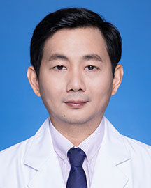

<!-- AUTO-GENERATED-BY: work/generate_obsidian_profiles.py -->

<!-- TEMPLATE: D:\workspace\信息收集整理\医生画像仓库\模板\医生画像模板.md -->

# 黄宏明

## 基础信息

| 字段 | 内容 |
|---|---|
| 姓名 | 黄宏明 |
| 医院 | 广东省人民医院 |
| 科室 | 耳科 |
| 职称/身份 | 副主任医师 |
| 来源链接 | [官网原文](https://www.gdghospital.org.cn/Expertlistt/info_itemid_24951_subjectid_109.html) |
| 采集日期 | 2026-08-14 |

## 简介/擅长

主要从事耳-侧颅底外科及眩晕疾病的诊治，尤其在耳内镜微创手术有较深的造诣

## 教育与进修经历

- 简介 ： 医学博士，新加坡国立大学访问学者。
- 全国耳内镜外科技术规范化培训协作组成员；

## 可包装亮点

- 简介 ： 医学博士，新加坡国立大学访问学者。
- 从事耳科临床工作20余年，具备扎实的理论基础和丰富的临床经验，曾到德国慕尼黑大学附属医院及中国人民医院解放军总医院交流学习。
- 现任广东省医院协会眩晕中心建设管理专业委员会副主任委员；
- 广东省医院协会眩晕中心建设管理专业青年委员会主任委员广东省精准医学应用学会听觉与前庭障碍分会副主任委员；

## 重点疾病/人群标签

- 慢性病：慢性、肿瘤、癌、瘤、放疗、鼻咽癌、康复
- 肿瘤：慢性、肿瘤、癌、瘤、放疗、鼻咽癌、康复
- 生殖疾病：
- 免疫/风湿：
- 术后恢复/康复：慢性、肿瘤、癌、瘤、放疗、鼻咽癌、康复
- 疑难重症：

## 证据摘录

> 只摘录官网公开信息中的短句或关键字段，不复制大段原文。

- 官网身份字段：副主任医师
- 官网简介/擅长：主要从事耳-侧颅底外科及眩晕疾病的诊治，尤其在耳内镜微创手术有较深的造诣
- 官网亮眼经历线索：简介 ： 医学博士，新加坡国立大学访问学者。 从事耳科临床工作20余年，具备扎实的理论基础和丰富的临床经验，曾到德国慕尼黑大学附属医院及中国人民医院解放军总医院交流学习。 现任广东省医院协会眩晕中心建设管理专业委员会副主任委员； 广东省医院协会眩晕中心建设管理专业青年委员会主任委员广东省精准医学应用学会听觉与前庭障碍分会副主任委员；
- 来源链接：https://www.gdghospital.org.cn/Expertlistt/info_itemid_24951_subjectid_109.html

## BD 画像摘要

黄宏明医生可作为慢性病、肿瘤、术后恢复/康复方向的基础画像候选。后续 BD 使用应继续以官网来源和人工复核为准，不添加疗效承诺或无来源包装。

## 合规边界

- 仅使用医院官网、官方公众号、官方小程序等公开渠道。
- 不采集私人电话、私人微信、家庭住址、患者隐私或非公开排班信息。
- 不写“保证治愈”“疗效第一”“包治疑难杂症”等无法由官网证明的表述。
