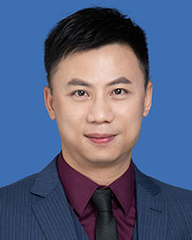

<!-- AUTO-GENERATED-BY: work/generate_obsidian_profiles.py -->

<!-- TEMPLATE: D:\workspace\信息收集整理\医生画像仓库\模板\医生画像模板.md -->

# 黄帅豪

## 基础信息

| 字段 | 内容 |
|---|---|
| 姓名 | 黄帅豪 |
| 医院 | 广东省人民医院 |
| 科室 | 麻醉科 |
| 职称/身份 | 医师 |
| 来源链接 | [官网原文](https://www.gdghospital.org.cn/Expertlistt/info_itemid_34055_subjectid_13.html) |
| 采集日期 | 2026-08-14 |

## 简介/擅长

老年性脊柱骨质疏松患者的系统性治疗

## 科研项目与成果

- 主持及参与科研立项8项。

## 论文与学术产出

- 学术专业领域成就 多次在国内、外各种学术会议上汇报演讲，以第一作者发表SCI和核心期刊论文10余篇。
- 获得2018世界脊柱学术峰会(Spine World Summit)优秀讲者、十二届中国骨科医师医师年会“十大优秀论文作者”。

## 可包装亮点

- 中共党员 医学博士 主要社会兼职 中国医师协会会员， 中国康复医学会专业委员 广东省医学会脊柱外科分会会员， 广东省康复医学会颈椎外科专委会会员 广东省中西医结合学会脊柱医学专委会 教育经历和专业特长 规范接受国际临床中心系统的专业训练，定期到国内、外顶尖医院学习最新技术，并获国家器械临床试验GCP资格。
- 学术专业领域成就 多次在国内、外各种学术会议上汇报演讲，以第一作者发表SCI和核心期刊论文10余篇。

## 重点疾病/人群标签

- 慢性病：
- 肿瘤：肿瘤、康复
- 生殖疾病：
- 免疫/风湿：
- 术后恢复/康复：肿瘤、康复
- 疑难重症：

## 证据摘录

> 只摘录官网公开信息中的短句或关键字段，不复制大段原文。

- 官网身份字段：医师
- 官网简介/擅长：老年性脊柱骨质疏松患者的系统性治疗
- 官网亮眼经历线索：中共党员 医学博士 主要社会兼职 中国医师协会会员， 中国康复医学会专业委员 广东省医学会脊柱外科分会会员， 广东省康复医学会颈椎外科专委会会员 广东省中西医结合学会脊柱医学专委会 教育经历和专业特长 规范接受国际临床中心系统的专业训练，定期到国内、外顶尖医院学习最新技术，并获国家器械临床试验GCP资格。 学术专业领域成就 多次在国内、外各种学术会议上汇报演讲，以第一作者发表SCI和核心期刊论文10余篇。
- 来源链接：https://www.gdghospital.org.cn/Expertlistt/info_itemid_34055_subjectid_13.html

## BD 画像摘要

黄帅豪医生可作为肿瘤、术后恢复/康复方向的基础画像候选。后续 BD 使用应继续以官网来源和人工复核为准，不添加疗效承诺或无来源包装。

## 合规边界

- 仅使用医院官网、官方公众号、官方小程序等公开渠道。
- 不采集私人电话、私人微信、家庭住址、患者隐私或非公开排班信息。
- 不写“保证治愈”“疗效第一”“包治疑难杂症”等无法由官网证明的表述。
