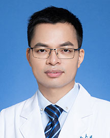

<!-- AUTO-GENERATED-BY: work/generate_obsidian_profiles.py -->

<!-- TEMPLATE: D:\workspace\信息收集整理\医生画像仓库\模板\医生画像模板.md -->

# 黄文汉

## 基础信息

| 字段 | 内容 |
|---|---|
| 姓名 | 黄文汉 |
| 医院 | 广东省人民医院 |
| 科室 | 骨肿瘤科 |
| 职称/身份 | 主治医师 |
| 来源链接 | [官网原文](https://www.gdghospital.org.cn/Expertlistt/info_itemid_24324_subjectid_50.html) |
| 采集日期 | 2026-08-14 |

## 简介/擅长

1.擅长四肢及躯干体表良性包块（脂肪瘤、血管瘤、神经鞘瘤等）及骨良性增生的切除手术

## 教育与进修经历

- 简介 从事骨与软组织肿瘤及退变性关节病的诊疗十余年，主治医师，医学博士，毕业于香港中文大学矫形与创伤学系。

## 科研项目与成果

- 担任多个海外骨科学术学会委员，任职包括：国际骨科研究协会 (ORS)、国际关节镜、膝关节手术及运动医学协会(ISAKOS)、欧洲运动创伤、膝关节手术及关节镜协会(ESSKA)、亚太膝关节镜及运动医学协会(APKASS)、香港骨科协会(HKOA)（常务委员及骨科协会大使）及中国临床肿瘤学会(CSCO)委员。
- 主持广东省自然科学基金面上项目、广州市科技项目等科研项目。

## 可包装亮点

- 2.擅长骨与软组织（皮肤肌肉筋膜肌腱）的消融微创手术（微创切除、微创灭活病灶、精准活检）；
- 担任多个海外骨科学术学会委员，任职包括：国际骨科研究协会 (ORS)、国际关节镜、膝关节手术及运动医学协会(ISAKOS)、欧洲运动创伤、膝关节手术及关节镜协会(ESSKA)、亚太膝关节镜及运动医学协会(APKASS)、香港骨科协会(HKOA)（常务委员及骨科协会大使）及中国临床肿瘤学会(CSCO)委员。
- 荣誉奖励 1.广东省科学技术奖科技进步奖二等奖（2025 年） 2.广东省精准医学科学技术科技创新奖一等奖（2023 年） 3.香港骨科协会大使(2019 年) 4.APOA 运动医学会议游学奖学金(2019 年) 5.香港骨科协会游学奖学金 (2018 年) 6.香港骨科年会运动医学最佳报告金奖 (2018 年) 7.香港骨科协会游学奖学金 (2017…

## 重点疾病/人群标签

- 慢性病：
- 肿瘤：肿瘤、癌、瘤、化疗、靶向、肺癌、肝癌、乳腺癌、免疫
- 生殖疾病：
- 免疫/风湿：肿瘤、癌、瘤、化疗、靶向、肺癌、肝癌、乳腺癌、免疫
- 术后恢复/康复：
- 疑难重症：

## 证据摘录

> 只摘录官网公开信息中的短句或关键字段，不复制大段原文。

- 官网身份字段：主治医师
- 官网简介/擅长：1.擅长四肢及躯干体表良性包块（脂肪瘤、血管瘤、神经鞘瘤等）及骨良性增生的切除手术
- 官网亮眼经历线索：2.擅长骨与软组织（皮肤肌肉筋膜肌腱）的消融微创手术（微创切除、微创灭活病灶、精准活检）； 担任多个海外骨科学术学会委员，任职包括：国际骨科研究协会 (ORS)、国际关节镜、膝关节手术及运动医学协会(ISAKOS)、欧洲运动创伤、膝关节手术及关节镜协会(ESSKA)、亚太膝关节镜及运动医学协会(APKASS)、香港骨科协会(HKOA)（常务委员及骨科协会大使）及中国临床肿瘤学会(CSCO)委员。 荣誉奖励 1.广东省科学技术奖科技进步…
- 来源链接：https://www.gdghospital.org.cn/Expertlistt/info_itemid_24324_subjectid_50.html

## BD 画像摘要

黄文汉医生可作为肿瘤、免疫/风湿/感染方向的基础画像候选。后续 BD 使用应继续以官网来源和人工复核为准，不添加疗效承诺或无来源包装。

## 合规边界

- 仅使用医院官网、官方公众号、官方小程序等公开渠道。
- 不采集私人电话、私人微信、家庭住址、患者隐私或非公开排班信息。
- 不写“保证治愈”“疗效第一”“包治疑难杂症”等无法由官网证明的表述。
