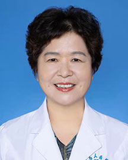

<!-- AUTO-GENERATED-BY: work/generate_obsidian_profiles.py -->

<!-- TEMPLATE: D:\workspace\信息收集整理\医生画像仓库\模板\医生画像模板.md -->

# 黄映英

## 基础信息

| 字段 | 内容 |
|---|---|
| 姓名 | 黄映英 |
| 医院 | 广东省人民医院 |
| 科室 | 超声科 |
| 职称/身份 | 副主任技师 |
| 来源链接 | [官网原文](https://www.gdghospital.org.cn/Expertlistt/info_itemid_25263_subjectid_62.html) |
| 采集日期 | 2026-08-14 |

## 简介/擅长

浅表器官、妇科及血管等疾病的超声检查及诊断 从事超声检查及诊断工作三十多年，熟练掌握消化系统、泌尿系统、妇产科、生殖系统、浅表器官、眼球、心血管及外周血管等疾病的超声检查及诊断，并积累了较丰富的经验

## 教育与进修经历

- 毕业于中山大学临床医学专业 专长：浅表器官、妇科及血管等疾病的超声检查及诊断 从事超声检查及诊断工作三十多年，熟练掌握消化系统、泌尿系统、妇产科、生殖系统、浅表器官、眼球、心血管及外周血管等疾病的超声检查及诊断，并积累了较丰富的经验。

## 科研项目与成果

- 主持并完成省级资助的科研项目。

## 论文与学术产出

- 在国家级及省级核心期刊发表多篇学术论文

## 可包装亮点

- 在国家级及省级核心期刊发表多篇学术论文

## 重点疾病/人群标签

- 慢性病：
- 肿瘤：
- 生殖疾病：生殖
- 免疫/风湿：
- 术后恢复/康复：
- 疑难重症：

## 证据摘录

> 只摘录官网公开信息中的短句或关键字段，不复制大段原文。

- 官网身份字段：副主任技师
- 官网简介/擅长：浅表器官、妇科及血管等疾病的超声检查及诊断 从事超声检查及诊断工作三十多年，熟练掌握消化系统、泌尿系统、妇产科、生殖系统、浅表器官、眼球、心血管及外周血管等疾病的超声检查及诊断，并积累了较丰富的经验
- 官网亮眼经历线索：在国家级及省级核心期刊发表多篇学术论文
- 来源链接：https://www.gdghospital.org.cn/Expertlistt/info_itemid_25263_subjectid_62.html

## BD 画像摘要

黄映英医生可作为生殖疾病方向的基础画像候选。后续 BD 使用应继续以官网来源和人工复核为准，不添加疗效承诺或无来源包装。

## 合规边界

- 仅使用医院官网、官方公众号、官方小程序等公开渠道。
- 不采集私人电话、私人微信、家庭住址、患者隐私或非公开排班信息。
- 不写“保证治愈”“疗效第一”“包治疑难杂症”等无法由官网证明的表述。
