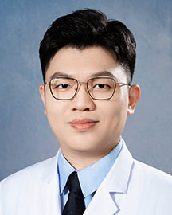

<!-- AUTO-GENERATED-BY: work/generate_obsidian_profiles.py -->

<!-- TEMPLATE: D:\workspace\信息收集整理\医生画像仓库\模板\医生画像模板.md -->

# 黄群生

## 基础信息

| 字段 | 内容 |
|---|---|
| 姓名 | 黄群生 |
| 医院 | 广东省人民医院 |
| 科室 | 胃肠外科 |
| 职称/身份 | 住院医师 |
| 来源链接 | [官网原文](https://www.gdghospital.org.cn/Expertlistt/info_itemid_65700_subjectid_104.html) |
| 采集日期 | 2026-08-14 |

## 简介/擅长

从事胃肠外科临床专科工作5年余，擅长胃恶性肿瘤、食管胃结合部恶性肿瘤、胃 肠道间质瘤、食管裂孔疝、急慢性阑尾炎等相关消化道疾病诊疗

## 教育与进修经历

- 简介 医学博士，2015年于中山大学中山医学院临床医学专业本科毕业，2018年于中山 大学附属第六医院外科学专业硕士毕业，2021年于中山大学肿瘤防治中山肿瘤学 专业博士毕业。

## 科研项目与成果

- 在Journal of Hepatology，Cell Death and Disease等杂志发表胃 肠道相关文章10余篇，参与多项国自然面上项目基金，主持市科技计划项目1项。

## 论文与学术产出

- 在Journal of Hepatology，Cell Death and Disease等杂志发表胃 肠道相关文章10余篇，参与多项国自然面上项目基金，主持市科技计划项目1项。

## 可包装亮点

- 在Journal of Hepatology，Cell Death and Disease等杂志发表胃 肠道相关文章10余篇，参与多项国自然面上项目基金，主持市科技计划项目1项。

## 重点疾病/人群标签

- 慢性病：慢性、肿瘤、瘤、术后、康复
- 肿瘤：慢性、肿瘤、瘤、术后、康复
- 生殖疾病：
- 免疫/风湿：
- 术后恢复/康复：慢性、肿瘤、瘤、术后、康复
- 疑难重症：

## 证据摘录

> 只摘录官网公开信息中的短句或关键字段，不复制大段原文。

- 官网身份字段：住院医师
- 官网简介/擅长：从事胃肠外科临床专科工作5年余，擅长胃恶性肿瘤、食管胃结合部恶性肿瘤、胃 肠道间质瘤、食管裂孔疝、急慢性阑尾炎等相关消化道疾病诊疗
- 官网亮眼经历线索：在Journal of Hepatology，Cell Death and Disease等杂志发表胃 肠道相关文章10余篇，参与多项国自然面上项目基金，主持市科技计划项目1项。
- 来源链接：https://www.gdghospital.org.cn/Expertlistt/info_itemid_65700_subjectid_104.html

## BD 画像摘要

黄群生医生可作为慢性病、肿瘤、术后恢复/康复方向的基础画像候选。后续 BD 使用应继续以官网来源和人工复核为准，不添加疗效承诺或无来源包装。

## 合规边界

- 仅使用医院官网、官方公众号、官方小程序等公开渠道。
- 不采集私人电话、私人微信、家庭住址、患者隐私或非公开排班信息。
- 不写“保证治愈”“疗效第一”“包治疑难杂症”等无法由官网证明的表述。
