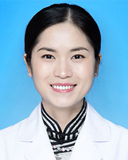

<!-- AUTO-GENERATED-BY: work/generate_obsidian_profiles.py -->

<!-- TEMPLATE: D:\workspace\信息收集整理\医生画像仓库\模板\医生画像模板.md -->

# 黄艳

## 基础信息

| 字段 | 内容 |
|---|---|
| 姓名 | 黄艳 |
| 医院 | 广东省人民医院 |
| 科室 | 耳科 |
| 职称/身份 | 副主任医师 |
| 来源链接 | [官网原文](https://www.gdghospital.org.cn/Expertlistt/info_itemid_40374_subjectid_109.html) |
| 采集日期 | 2026-08-14 |

## 简介/擅长

医学绘画，参编或参译多本医学著作

## 教育与进修经历

- 医学博士，副主任医师 2014 年上海交通大学医学院临床医学八年制博士毕业，师从著名的耳神经侧颅底外科专家吴皓教授，毕业后就职于广东省人民医院耳鼻咽喉头颈外科至今。
- 曾于中国医学科学院整形外科医院整形美容外科耳整形再造科进修学习。

## 科研项目与成果

- 先后主持省市级课题 3 项，发表SCI 论文 5 篇。

## 论文与学术产出

- 先后主持省市级课题 3 项，发表SCI 论文 5 篇。
- 擅长医学绘画，参编或参译多本医学著作。

## 可包装亮点

- 医学博士，副主任医师 2014 年上海交通大学医学院临床医学八年制博士毕业，师从著名的耳神经侧颅底外科专家吴皓教授，毕业后就职于广东省人民医院耳鼻咽喉头颈外科至今。
- 先后主持省市级课题 3 项，发表SCI 论文 5 篇。
- 在2022 年、 2023 年中华医学会全国耳鼻咽喉头颈外科学术会议中青年医师手术视频比赛中获奖， 在 2022年、 2023 年广东省医学会耳鼻咽喉学学术会议中青年医师手术视频比赛中获奖。
- 曾于中国医学科学院整形外科医院整形美容外科耳整形再造科进修学习。

## 重点疾病/人群标签

- 慢性病：慢性、瘤、康复
- 肿瘤：慢性、瘤、康复
- 生殖疾病：
- 免疫/风湿：
- 术后恢复/康复：慢性、瘤、康复
- 疑难重症：

## 证据摘录

> 只摘录官网公开信息中的短句或关键字段，不复制大段原文。

- 官网身份字段：副主任医师
- 官网简介/擅长：医学绘画，参编或参译多本医学著作
- 官网亮眼经历线索：医学博士，副主任医师 2014 年上海交通大学医学院临床医学八年制博士毕业，师从著名的耳神经侧颅底外科专家吴皓教授，毕业后就职于广东省人民医院耳鼻咽喉头颈外科至今。 先后主持省市级课题 3 项，发表SCI 论文 5 篇。 在2022 年、 2023 年中华医学会全国耳鼻咽喉头颈外科学术会议中青年医师手术视频比赛中获奖， 在 2022年、 2023 年广东省医学会耳鼻咽喉学学术会议中青年医师手术视频比赛中获奖。 曾于中国医学科学院整形外…
- 来源链接：https://www.gdghospital.org.cn/Expertlistt/info_itemid_40374_subjectid_109.html

## BD 画像摘要

黄艳医生可作为慢性病、肿瘤、术后恢复/康复方向的基础画像候选。后续 BD 使用应继续以官网来源和人工复核为准，不添加疗效承诺或无来源包装。

## 合规边界

- 仅使用医院官网、官方公众号、官方小程序等公开渠道。
- 不采集私人电话、私人微信、家庭住址、患者隐私或非公开排班信息。
- 不写“保证治愈”“疗效第一”“包治疑难杂症”等无法由官网证明的表述。
