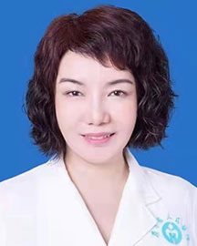

<!-- AUTO-GENERATED-BY: work/generate_obsidian_profiles.py -->

<!-- TEMPLATE: D:\workspace\信息收集整理\医生画像仓库\模板\医生画像模板.md -->

# 黄跃深

## 基础信息

| 字段 | 内容 |
|---|---|
| 姓名 | 黄跃深 |
| 医院 | 广东省人民医院 |
| 科室 | 皮肤性病科 |
| 职称/身份 | 副主任医师 |
| 来源链接 | [官网原文](https://www.gdghospital.org.cn/Expertlistt/info_itemid_23892_subjectid_22.html) |
| 采集日期 | 2026-08-14 |

## 简介/擅长

治疗过敏性皮肤病、性病、痤疮、白癜风、银屑病及损容性皮肤病

## 教育与进修经历

- 简介 ：医学学士，1992年起在广东省人民医院从事医疗、教学、科研及皮肤性病专科工作，曾到北京大学第一医院进修临床及皮肤病理，首都医科大学进修激光医学。
- 参与本专业各期进修、规培医师的理论及实践带教，主持及主要参与省、厅级科研基金课题多项。

## 科研项目与成果

- 简介 ：医学学士，1992年起在广东省人民医院从事医疗、教学、科研及皮肤性病专科工作，曾到北京大学第一医院进修临床及皮肤病理，首都医科大学进修激光医学。
- 参与本专业各期进修、规培医师的理论及实践带教，主持及主要参与省、厅级科研基金课题多项。

## 论文与学术产出

- 近年在核心医学刊物发表专业论文18篇。

## 可包装亮点

- 广东省医学美容学会皮肤修复学会常委 广东省整形美容协会皮肤美容分会委员 广东省医学会激光医学分会委员 广东省女医师协会皮肤专家委员会委员 特长 ：擅长治疗过敏性皮肤病、性病、痤疮、白癜风、银屑病及损容性皮肤病。
- 简介 ：医学学士，1992年起在广东省人民医院从事医疗、教学、科研及皮肤性病专科工作，曾到北京大学第一医院进修临床及皮肤病理，首都医科大学进修激光医学。
- 2006年至今聘任副主任医师并兼任南方医科大学本科学生理论大课教师。
- 参与本专业各期进修、规培医师的理论及实践带教，主持及主要参与省、厅级科研基金课题多项。

## 重点疾病/人群标签

- 慢性病：
- 肿瘤：
- 生殖疾病：
- 免疫/风湿：
- 术后恢复/康复：
- 疑难重症：

## 证据摘录

> 只摘录官网公开信息中的短句或关键字段，不复制大段原文。

- 官网身份字段：副主任医师
- 官网简介/擅长：治疗过敏性皮肤病、性病、痤疮、白癜风、银屑病及损容性皮肤病
- 官网亮眼经历线索：广东省医学美容学会皮肤修复学会常委 广东省整形美容协会皮肤美容分会委员 广东省医学会激光医学分会委员 广东省女医师协会皮肤专家委员会委员 特长 ：擅长治疗过敏性皮肤病、性病、痤疮、白癜风、银屑病及损容性皮肤病。 简介 ：医学学士，1992年起在广东省人民医院从事医疗、教学、科研及皮肤性病专科工作，曾到北京大学第一医院进修临床及皮肤病理，首都医科大学进修激光医学。 2006年至今聘任副主任医师并兼任南方医科大学本科学生理论大课教师。 参…
- 来源链接：https://www.gdghospital.org.cn/Expertlistt/info_itemid_23892_subjectid_22.html

## BD 画像摘要

黄跃深医生可作为广东省人民医院皮肤性病科的基础医生资料入库。当前重点方向以总底表标签为准，官网未展示的信息保持空白。

## 合规边界

- 仅使用医院官网、官方公众号、官方小程序等公开渠道。
- 不采集私人电话、私人微信、家庭住址、患者隐私或非公开排班信息。
- 不写“保证治愈”“疗效第一”“包治疑难杂症”等无法由官网证明的表述。
