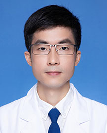

<!-- AUTO-GENERATED-BY: work/generate_obsidian_profiles.py -->

<!-- TEMPLATE: D:\workspace\信息收集整理\医生画像仓库\模板\医生画像模板.md -->

# 黎庆钿

## 基础信息

| 字段 | 内容 |
|---|---|
| 姓名 | 黎庆钿 |
| 医院 | 广东省人民医院 |
| 科室 | 关节骨病与创伤科 |
| 职称/身份 | 主治医师 |
| 来源链接 | [官网原文](https://www.gdghospital.org.cn/Expertlistt/info_itemid_24835_subjectid_49.html) |
| 采集日期 | 2026-08-14 |

## 简介/擅长

膝关节病，股骨头缺血坏死，先天性髋关节脱位，髋关节发育不良，肩周炎，类风湿关节炎，肘关节僵硬，拇外翻，手麻症，创伤骨折，骨折畸形愈合、创伤后关节炎和关节置换术后假体周围骨折的治疗

## 教育与进修经历

- 中共党员，医学博士，毕业于北京大学，曾获北京市暨北京大学优秀毕业生称号。

## 科研项目与成果

- 学术科研 研究重点是促进骨形成、骨再生、骨和软骨愈合以及骨生物学。
- 第一作者发表SCI论文10篇，主持及参与国家及省自然科学基金课题4项。

## 论文与学术产出

- 第一作者发表SCI论文10篇，主持及参与国家及省自然科学基金课题4项。

## 可包装亮点

- 2017年作为人工关节置换的客座研究员在德国柏林Pankow医院学习。
- 第一作者发表SCI论文10篇，主持及参与国家及省自然科学基金课题4项。
- 学术任职 中国医师协会骨科医师分会青年委员会智能科学组委员 广东省医医师协会关节外科分会青年委员 广东省医学会关节外科分会青年委员 广东省健康管理学会骨科专业委员会委员 广东省精准医学会痛风及高尿酸血症分会委员

## 重点疾病/人群标签

- 慢性病：
- 肿瘤：
- 生殖疾病：
- 免疫/风湿：类风湿、术后
- 术后恢复/康复：类风湿、术后
- 疑难重症：

## 证据摘录

> 只摘录官网公开信息中的短句或关键字段，不复制大段原文。

- 官网身份字段：主治医师
- 官网简介/擅长：膝关节病，股骨头缺血坏死，先天性髋关节脱位，髋关节发育不良，肩周炎，类风湿关节炎，肘关节僵硬，拇外翻，手麻症，创伤骨折，骨折畸形愈合、创伤后关节炎和关节置换术后假体周围骨折的治疗
- 官网亮眼经历线索：2017年作为人工关节置换的客座研究员在德国柏林Pankow医院学习。 第一作者发表SCI论文10篇，主持及参与国家及省自然科学基金课题4项。 学术任职 中国医师协会骨科医师分会青年委员会智能科学组委员 广东省医医师协会关节外科分会青年委员 广东省医学会关节外科分会青年委员 广东省健康管理学会骨科专业委员会委员 广东省精准医学会痛风及高尿酸血症分会委员
- 来源链接：https://www.gdghospital.org.cn/Expertlistt/info_itemid_24835_subjectid_49.html

## BD 画像摘要

黎庆钿医生可作为免疫/风湿/感染、术后恢复/康复方向的基础画像候选。后续 BD 使用应继续以官网来源和人工复核为准，不添加疗效承诺或无来源包装。

## 合规边界

- 仅使用医院官网、官方公众号、官方小程序等公开渠道。
- 不采集私人电话、私人微信、家庭住址、患者隐私或非公开排班信息。
- 不写“保证治愈”“疗效第一”“包治疑难杂症”等无法由官网证明的表述。
