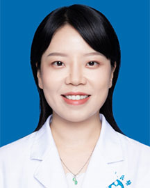

<!-- AUTO-GENERATED-BY: work/generate_obsidian_profiles.py -->

<!-- TEMPLATE: D:\workspace\信息收集整理\医生画像仓库\模板\医生画像模板.md -->

# 黎莹

## 基础信息

| 字段 | 内容 |
|---|---|
| 姓名 | 黎莹 |
| 医院 | 广东省人民医院 |
| 科室 | 肿瘤内科 |
| 职称/身份 | 副主任医师 |
| 来源链接 | [官网原文](https://www.gdghospital.org.cn/Expertlistt/info_itemid_33893_subjectid_33.html) |
| 采集日期 | 2026-08-14 |

## 简介/擅长

消化道恶性肿瘤（食管癌、胃癌、结直肠癌、肝癌、胰腺癌）、头颈恶性肿瘤等多种实体瘤的化疗

## 教育与进修经历

- 中山大学中山医学院毕业。

## 科研项目与成果

- 参与多项省市级课题基金及多项国内及国际多中心临床研究。

## 可包装亮点

- 目前担任广州抗癌协会肝胆胰肿瘤专业委员会秘书兼青年委员、广东省抗癌学会靶向与个体化治疗专业委员会青年委员、广东省抗癌协会生物治疗专业委员会委员等多项社会职务。

## 重点疾病/人群标签

- 慢性病：
- 肿瘤：肿瘤、癌、瘤、化疗、靶向、肝癌、胃癌、肠癌、免疫
- 生殖疾病：
- 免疫/风湿：肿瘤、癌、瘤、化疗、靶向、肝癌、胃癌、肠癌、免疫
- 术后恢复/康复：
- 疑难重症：

## 证据摘录

> 只摘录官网公开信息中的短句或关键字段，不复制大段原文。

- 官网身份字段：副主任医师
- 官网简介/擅长：消化道恶性肿瘤（食管癌、胃癌、结直肠癌、肝癌、胰腺癌）、头颈恶性肿瘤等多种实体瘤的化疗
- 官网亮眼经历线索：目前担任广州抗癌协会肝胆胰肿瘤专业委员会秘书兼青年委员、广东省抗癌学会靶向与个体化治疗专业委员会青年委员、广东省抗癌协会生物治疗专业委员会委员等多项社会职务。
- 来源链接：https://www.gdghospital.org.cn/Expertlistt/info_itemid_33893_subjectid_33.html

## BD 画像摘要

黎莹医生可作为肿瘤、免疫/风湿/感染方向的基础画像候选。后续 BD 使用应继续以官网来源和人工复核为准，不添加疗效承诺或无来源包装。

## 合规边界

- 仅使用医院官网、官方公众号、官方小程序等公开渠道。
- 不采集私人电话、私人微信、家庭住址、患者隐私或非公开排班信息。
- 不写“保证治愈”“疗效第一”“包治疑难杂症”等无法由官网证明的表述。
