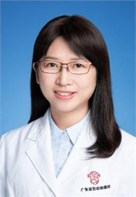

<!-- AUTO-GENERATED-BY: work/generate_obsidian_profiles.py -->

<!-- TEMPLATE: D:\workspace\信息收集整理\医生画像仓库\模板\医生画像模板.md -->

# 余凡

## 基础信息

| 字段 | 内容 |
|---|---|
| 姓名 | 余凡 |
| 医院 | 广东省妇幼保健院 |
| 科室 | 妇科（越秀院区） |
| 职称/身份 | 主任医师 |
| 来源链接 | [官网原文](https://www.e3861.com/keshizhuanjia/zhuanjiajieshao/32549.html) |
| 采集日期 | 2026-08-14 |

## 简介/擅长

## 教育与进修经历

- 硕士研究生导师，妇科内分泌专科主任，国家级妇科四级内镜培训基地指导老师，省妇幼规范化专科医师培训优秀带教老师，有近20年的临床工作经验。

## 可包装亮点

- 硕士研究生导师，妇科内分泌专科主任，国家级妇科四级内镜培训基地指导老师，省妇幼规范化专科医师培训优秀带教老师，有近20年的临床工作经验。
- 广东省医师协会妇产科分会常务委员；
- 广东省女医师协会委员；
- 中国医药教育协会生殖内分泌委员；

## 重点疾病/人群标签

- 慢性病：
- 肿瘤：癌、瘤、生殖、不孕、卵巢、妇科内分泌、多囊、月经、免疫、难治
- 生殖疾病：癌、瘤、生殖、不孕、卵巢、妇科内分泌、多囊、月经、免疫、难治
- 免疫/风湿：癌、瘤、生殖、不孕、卵巢、妇科内分泌、多囊、月经、免疫、难治
- 术后恢复/康复：
- 疑难重症：癌、瘤、生殖、不孕、卵巢、妇科内分泌、多囊、月经、免疫、难治

## 证据摘录

> 只摘录官网公开信息中的短句或关键字段，不复制大段原文。

- 官网身份字段：主任医师
- 官网亮眼经历线索：硕士研究生导师，妇科内分泌专科主任，国家级妇科四级内镜培训基地指导老师，省妇幼规范化专科医师培训优秀带教老师，有近20年的临床工作经验。 广东省医师协会妇产科分会常务委员； 广东省女医师协会委员； 中国医药教育协会生殖内分泌委员；
- 来源链接：https://www.e3861.com/keshizhuanjia/zhuanjiajieshao/32549.html

## BD 画像摘要

余凡医生可作为肿瘤、生殖疾病、免疫/风湿/感染、疑难重症方向的基础画像候选。后续 BD 使用应继续以官网来源和人工复核为准，不添加疗效承诺或无来源包装。

## 合规边界

- 仅使用医院官网、官方公众号、官方小程序等公开渠道。
- 不采集私人电话、私人微信、家庭住址、患者隐私或非公开排班信息。
- 不写“保证治愈”“疗效第一”“包治疑难杂症”等无法由官网证明的表述。
