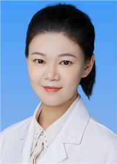

<!-- AUTO-GENERATED-BY: work/generate_obsidian_profiles.py -->

<!-- TEMPLATE: D:\workspace\信息收集整理\医生画像仓库\模板\医生画像模板.md -->

# 农璎琦

## 基础信息

| 字段 | 内容 |
|---|---|
| 姓名 | 农璎琦 |
| 医院 | 广东省妇幼保健院 |
| 科室 | 生殖健康与不孕症科、早孕关爱（番禺院区） |
| 职称/身份 | 副主任医师 |
| 来源链接 | [官网原文](https://www.e3861.com/keshizhuanjia/zhuanjiajieshao/32873.html) |
| 采集日期 | 2026-08-14 |

## 简介/擅长

## 科研项目与成果

- 作为院内临床科研骨干，主持、参加国家级、省厅级课题多项，发表SCI论文十余篇，主要参与项目曾获广东省科技进步二等奖。

## 论文与学术产出

- 作为院内临床科研骨干，主持、参加国家级、省厅级课题多项，发表SCI论文十余篇，主要参与项目曾获广东省科技进步二等奖。

## 可包装亮点

- 医学博士，硕士研究生导师，英国St.George’s University hospital研修经历。
- 学术任职： 广东省妇幼保健协会常任委员 广东省医学会生殖医学分会第四届委员会临床学组成员 全国卫生协会生殖免疫专业委员会委员 广东省基层医药学会生殖医学管理专业委员会委员 专业特长： 擅长不孕不育、盆腔炎性疾病后遗症、卵巢功能减退、多囊卵巢综合征等相关妇科内分泌疾病合并不孕症的诊疗。
- 作为院内临床科研骨干，主持、参加国家级、省厅级课题多项，发表SCI论文十余篇，主要参与项目曾获广东省科技进步二等奖。

## 重点疾病/人群标签

- 慢性病：
- 肿瘤：
- 生殖疾病：生殖、不孕、卵巢、辅助生殖、妇科内分泌、多囊、免疫
- 免疫/风湿：生殖、不孕、卵巢、辅助生殖、妇科内分泌、多囊、免疫
- 术后恢复/康复：
- 疑难重症：

## 证据摘录

> 只摘录官网公开信息中的短句或关键字段，不复制大段原文。

- 官网身份字段：副主任医师
- 官网亮眼经历线索：医学博士，硕士研究生导师，英国St.George’s University hospital研修经历。 学术任职： 广东省妇幼保健协会常任委员 广东省医学会生殖医学分会第四届委员会临床学组成员 全国卫生协会生殖免疫专业委员会委员 广东省基层医药学会生殖医学管理专业委员会委员 专业特长： 擅长不孕不育、盆腔炎性疾病后遗症、卵巢功能减退、多囊卵巢综合征等相关妇科内分泌疾病合并不孕症的诊疗。 作为院内临床科研骨干，主持、参加国家级、省厅级课…
- 来源链接：https://www.e3861.com/keshizhuanjia/zhuanjiajieshao/32873.html

## BD 画像摘要

农璎琦医生可作为生殖疾病、免疫/风湿/感染方向的基础画像候选。后续 BD 使用应继续以官网来源和人工复核为准，不添加疗效承诺或无来源包装。

## 合规边界

- 仅使用医院官网、官方公众号、官方小程序等公开渠道。
- 不采集私人电话、私人微信、家庭住址、患者隐私或非公开排班信息。
- 不写“保证治愈”“疗效第一”“包治疑难杂症”等无法由官网证明的表述。
