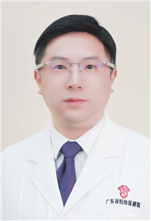

<!-- AUTO-GENERATED-BY: work/generate_obsidian_profiles.py -->

<!-- TEMPLATE: D:\workspace\信息收集整理\医生画像仓库\模板\医生画像模板.md -->

# 刘王凯

## 基础信息

| 字段 | 内容 |
|---|---|
| 姓名 | 刘王凯 |
| 医院 | 广东省妇幼保健院 |
| 科室 | 儿科呼吸、普通儿科、儿童过敏多学科联合（番禺院区、越秀院区、天河院区） |
| 职称/身份 | 主任医师 |
| 来源链接 | [官网原文](https://www.e3861.com/keshizhuanjia/zhuanjiajieshao/33218.html) |
| 采集日期 | 2026-08-14 |

## 简介/擅长

熟练掌握儿科常见病诊治，专长儿童过敏性疾病的诊治，包括牛奶蛋白过敏，过敏性鼻炎、乳糖不耐受，婴儿湿疹，支气管肺炎、早产儿院内外营养管理，新生儿败血症、呼吸窘迫综合征、新生儿坏死性小肠结肠炎等。

## 教育与进修经历

- 广东省“实力中青年医生”、《中华围产医学杂志》青年编委、《中国毕业后医学教育》审稿专家。

## 科研项目与成果

- 主任医师，医学博士，中山大学博士生导师 广东省妇幼保健院儿科主任 2003年7月~2024年12月在中山大学附属第一医院儿科工作，专注儿童过敏性疾病及新生儿疾病的临床诊治及科学研究，近五年在Immunity、JCI、CTM、Pediatr Pulm.、《中华围产医学杂志》、《中华新生儿科杂志》等行业知名期刊上发表多篇高影响力学术论文，承担多项省部级科研攻关项目。

## 论文与学术产出

- 主任医师，医学博士，中山大学博士生导师 广东省妇幼保健院儿科主任 2003年7月~2024年12月在中山大学附属第一医院儿科工作，专注儿童过敏性疾病及新生儿疾病的临床诊治及科学研究，近五年在Immunity、JCI、CTM、Pediatr Pulm.、《中华围产医学杂志》、《中华新生儿科杂志》等行业知名期刊上发表多篇高影响力学术论文，承担多项省部级科研攻关项目。

## 可包装亮点

- 主任医师，医学博士，中山大学博士生导师 广东省妇幼保健院儿科主任 2003年7月~2024年12月在中山大学附属第一医院儿科工作，专注儿童过敏性疾病及新生儿疾病的临床诊治及科学研究，近五年在Immunity、JCI、CTM、Pediatr Pulm.、《中华围产医学杂志》、《中华新生儿科杂志》等行业知名期刊上发表多篇高影响力学术论文，承担多项省部级科研攻关…
- 学术兼职： 中华医学会围产医学分会第九届、第十届青年学组副组长 广东省医学会母胎医学分会 副主任委员 广东省医院协会新生儿管理专委会副主任委员 广州市医学会新生儿科学分会副主任委员 广东省基层医药学会小儿遗传代谢分会 副主任委员 广东省医学会围产医学分会呼吸与肺脏超声学组副组长 广东省医学会新生儿分会复苏学组副组长

## 重点疾病/人群标签

- 慢性病：代谢、营养、多学科
- 肿瘤：
- 生殖疾病：
- 免疫/风湿：
- 术后恢复/康复：代谢、营养、多学科
- 疑难重症：代谢、营养、多学科

## 证据摘录

> 只摘录官网公开信息中的短句或关键字段，不复制大段原文。

- 官网身份字段：主任医师
- 官网简介/擅长：熟练掌握儿科常见病诊治，专长儿童过敏性疾病的诊治，包括牛奶蛋白过敏，过敏性鼻炎、乳糖不耐受，婴儿湿疹，支气管肺炎、早产儿院内外营养管理，新生儿败血症、呼吸窘迫综合征、新生儿坏死性小肠结肠炎等。
- 官网亮眼经历线索：主任医师，医学博士，中山大学博士生导师 广东省妇幼保健院儿科主任 2003年7月~2024年12月在中山大学附属第一医院儿科工作，专注儿童过敏性疾病及新生儿疾病的临床诊治及科学研究，近五年在Immunity、JCI、CTM、Pediatr Pulm.、《中华围产医学杂志》、《中华新生儿科杂志》等行业知名期刊上发表多篇高影响力学术论文，承担多项省部级科研攻关项目。 学术兼职： 中华医学会围产医学分会第九届、第十届青年学组副组长 广东省医…
- 来源链接：https://www.e3861.com/keshizhuanjia/zhuanjiajieshao/33218.html

## BD 画像摘要

刘王凯医生可作为慢性病、术后恢复/康复、疑难重症方向的基础画像候选。后续 BD 使用应继续以官网来源和人工复核为准，不添加疗效承诺或无来源包装。

## 合规边界

- 仅使用医院官网、官方公众号、官方小程序等公开渠道。
- 不采集私人电话、私人微信、家庭住址、患者隐私或非公开排班信息。
- 不写“保证治愈”“疗效第一”“包治疑难杂症”等无法由官网证明的表述。
