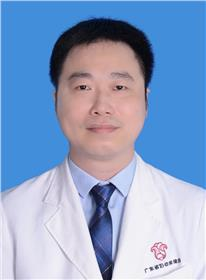

<!-- AUTO-GENERATED-BY: work/generate_obsidian_profiles.py -->

<!-- TEMPLATE: D:\workspace\信息收集整理\医生画像仓库\模板\医生画像模板.md -->

# 劳伟华

## 基础信息

| 字段 | 内容 |
|---|---|
| 姓名 | 劳伟华 |
| 医院 | 广东省妇幼保健院 |
| 科室 | 小儿泌尿外科、鞘膜积液日间手术（番禺院区、越秀院区、天河院区） |
| 职称/身份 | 主任医师 |
| 来源链接 | [官网原文](https://www.e3861.com/keshizhuanjia/zhuanjiajieshao/32487.html) |
| 采集日期 | 2026-08-14 |

## 简介/擅长

擅长隐睾，疝气、鞘膜积液、脐尿管瘘、先天性肾积水、重复肾畸形、巨输尿管

## 可包装亮点

- 主任医师，小儿泌尿外科主任 中国妇幼保健协会小儿泌尿微创学组青年委员 中国医师协会儿童重症医师分会结构畸形外科专业委员会委员 广东省临床医学学会胎儿医学专业委员会常务委员 广东省医师协会泌尿外科分会委员 广东省泌尿生殖协会性医学分会委员 广东省医学会小儿外科学分会委员会泌尿学组委员 广州市医师协会小儿外科医师分会常务委员 2017/2018/2019/20…

## 重点疾病/人群标签

- 慢性病：
- 肿瘤：肿瘤、生殖、重症
- 生殖疾病：肿瘤、生殖、重症
- 免疫/风湿：
- 术后恢复/康复：
- 疑难重症：肿瘤、生殖、重症

## 证据摘录

> 只摘录官网公开信息中的短句或关键字段，不复制大段原文。

- 官网身份字段：主任医师
- 官网简介/擅长：擅长隐睾，疝气、鞘膜积液、脐尿管瘘、先天性肾积水、重复肾畸形、巨输尿管
- 官网亮眼经历线索：主任医师，小儿泌尿外科主任 中国妇幼保健协会小儿泌尿微创学组青年委员 中国医师协会儿童重症医师分会结构畸形外科专业委员会委员 广东省临床医学学会胎儿医学专业委员会常务委员 广东省医师协会泌尿外科分会委员 广东省泌尿生殖协会性医学分会委员 广东省医学会小儿外科学分会委员会泌尿学组委员 广州市医师协会小儿外科医师分会常务委员 2017/2018/2019/2020/2021 连续五年评为好大夫在线“年度好大夫” 2022年第八届“羊城好医…
- 来源链接：https://www.e3861.com/keshizhuanjia/zhuanjiajieshao/32487.html

## BD 画像摘要

劳伟华医生可作为肿瘤、生殖疾病、疑难重症方向的基础画像候选。后续 BD 使用应继续以官网来源和人工复核为准，不添加疗效承诺或无来源包装。

## 合规边界

- 仅使用医院官网、官方公众号、官方小程序等公开渠道。
- 不采集私人电话、私人微信、家庭住址、患者隐私或非公开排班信息。
- 不写“保证治愈”“疗效第一”“包治疑难杂症”等无法由官网证明的表述。
