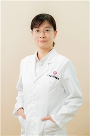

<!-- AUTO-GENERATED-BY: work/generate_obsidian_profiles.py -->

<!-- TEMPLATE: D:\workspace\信息收集整理\医生画像仓库\模板\医生画像模板.md -->

# 叶文慧

## 基础信息

| 字段 | 内容 |
|---|---|
| 姓名 | 叶文慧 |
| 医院 | 广东省妇幼保健院 |
| 科室 | 内科（番禺院区） |
| 职称/身份 | 主任医师 |
| 来源链接 | [官网原文](https://www.e3861.com/keshizhuanjia/zhuanjiajieshao/32828.html) |
| 采集日期 | 2026-08-14 |

## 简介/擅长

## 教育与进修经历

- 第二批全国西医学习中医项目优秀人才、中西医结合医学会生殖医学委员会委员、广东省妊娠合并内科疾病专业委员会委员、世界中医药学会优生优育专业委员会理事、美国南内华达大学医学院访问学者。

## 科研项目与成果

- 第二批全国西医学习中医项目优秀人才、中西医结合医学会生殖医学委员会委员、广东省妊娠合并内科疾病专业委员会委员、世界中医药学会优生优育专业委员会理事、美国南内华达大学医学院访问学者。
- 主持及参与省级医学研究课题多项。

## 论文与学术产出

- 在国内外杂志发表中西医相关学术论文多篇。

## 可包装亮点

- 主任医师，内科学硕士。
- 第二批全国西医学习中医项目优秀人才、中西医结合医学会生殖医学委员会委员、广东省妊娠合并内科疾病专业委员会委员、世界中医药学会优生优育专业委员会理事、美国南内华达大学医学院访问学者。
- 在国内外杂志发表中西医相关学术论文多篇。

## 重点疾病/人群标签

- 慢性病：
- 肿瘤：
- 生殖疾病：生殖
- 免疫/风湿：
- 术后恢复/康复：
- 疑难重症：

## 证据摘录

> 只摘录官网公开信息中的短句或关键字段，不复制大段原文。

- 官网身份字段：主任医师
- 官网亮眼经历线索：主任医师，内科学硕士。 第二批全国西医学习中医项目优秀人才、中西医结合医学会生殖医学委员会委员、广东省妊娠合并内科疾病专业委员会委员、世界中医药学会优生优育专业委员会理事、美国南内华达大学医学院访问学者。 在国内外杂志发表中西医相关学术论文多篇。
- 来源链接：https://www.e3861.com/keshizhuanjia/zhuanjiajieshao/32828.html

## BD 画像摘要

叶文慧医生可作为生殖疾病方向的基础画像候选。后续 BD 使用应继续以官网来源和人工复核为准，不添加疗效承诺或无来源包装。

## 合规边界

- 仅使用医院官网、官方公众号、官方小程序等公开渠道。
- 不采集私人电话、私人微信、家庭住址、患者隐私或非公开排班信息。
- 不写“保证治愈”“疗效第一”“包治疑难杂症”等无法由官网证明的表述。
