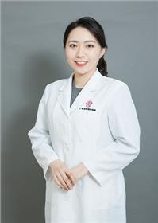

<!-- AUTO-GENERATED-BY: work/generate_obsidian_profiles.py -->

<!-- TEMPLATE: D:\workspace\信息收集整理\医生画像仓库\模板\医生画像模板.md -->

# 吕霄

## 基础信息

| 字段 | 内容 |
|---|---|
| 姓名 | 吕霄 |
| 医院 | 广东省妇幼保健院 |
| 科室 | 妇女保健科、妇科、更年期、40+女性健康（番禺院区、越秀院区） |
| 职称/身份 | 副主任医师 |
| 来源链接 | [官网原文](https://www.e3861.com/keshizhuanjia/zhuanjiajieshao/32810.html) |
| 采集日期 | 2026-08-14 |

## 简介/擅长

## 科研项目与成果

- 广东省基本公共卫生妇幼项目专家组成员。

## 可包装亮点

- 副主任医师，医学博士 广东省妇幼保健院妇女保健部副主任 荣获第十届羊城青年好医生、杏林暖阳美医生等 社会任职： 中国妇幼健康研究会更年期保健专业委员会委员；
- 中国优生优育协会生殖内分泌专业委员会委员；
- 中国女医师协会健康促进专业委员会委员；
- 广东省基层卫生协会妇幼保健分会副会长；

## 重点疾病/人群标签

- 慢性病：
- 肿瘤：癌、乳腺癌、生殖、卵巢、月经
- 生殖疾病：癌、乳腺癌、生殖、卵巢、月经
- 免疫/风湿：
- 术后恢复/康复：
- 疑难重症：

## 证据摘录

> 只摘录官网公开信息中的短句或关键字段，不复制大段原文。

- 官网身份字段：副主任医师
- 官网亮眼经历线索：副主任医师，医学博士 广东省妇幼保健院妇女保健部副主任 荣获第十届羊城青年好医生、杏林暖阳美医生等 社会任职： 中国妇幼健康研究会更年期保健专业委员会委员； 中国优生优育协会生殖内分泌专业委员会委员； 中国女医师协会健康促进专业委员会委员； 广东省基层卫生协会妇幼保健分会副会长；
- 来源链接：https://www.e3861.com/keshizhuanjia/zhuanjiajieshao/32810.html

## BD 画像摘要

吕霄医生可作为肿瘤、生殖疾病方向的基础画像候选。后续 BD 使用应继续以官网来源和人工复核为准，不添加疗效承诺或无来源包装。

## 合规边界

- 仅使用医院官网、官方公众号、官方小程序等公开渠道。
- 不采集私人电话、私人微信、家庭住址、患者隐私或非公开排班信息。
- 不写“保证治愈”“疗效第一”“包治疑难杂症”等无法由官网证明的表述。
