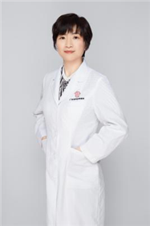

<!-- AUTO-GENERATED-BY: work/generate_obsidian_profiles.py -->

<!-- TEMPLATE: D:\workspace\信息收集整理\医生画像仓库\模板\医生画像模板.md -->

# 吴菁

## 基础信息

| 字段 | 内容 |
|---|---|
| 姓名 | 吴菁 |
| 医院 | 广东省妇幼保健院 |
| 科室 | 产前诊断、遗传病专科诊疗（番禺院区） |
| 职称/身份 | 主任医师 |
| 来源链接 | [官网原文](https://www.e3861.com/keshizhuanjia/zhuanjiajieshao/32452.html) |
| 采集日期 | 2026-08-14 |

## 简介/擅长

## 科研项目与成果

- 广东妇幼保健院医学遗传中心主任、妇产科学博士， 曾在澳大利亚悉尼韦思迈儿童医院、香港中文大学威尔斯亲王医院、美国波士顿儿童医院、英国伦敦国王学院医院英国胎儿医学基金会进行遗传检测技术及胎儿医学相关专业访学。
- 擅长： 一直致力于胎儿医学、遗传病产前诊断等临床、科研近二十年，在胎儿遗传产前诊断、胎儿发育评估、胎儿异常宫内治疗、复杂性双胎、多胎妊娠等方面有丰富的临床经验。

## 可包装亮点

- 广东妇幼保健院医学遗传中心主任、妇产科学博士， 曾在澳大利亚悉尼韦思迈儿童医院、香港中文大学威尔斯亲王医院、美国波士顿儿童医院、英国伦敦国王学院医院英国胎儿医学基金会进行遗传检测技术及胎儿医学相关专业访学。
- 社会任职： 中国妇幼保健协会临床诊断与实验医学分会分子诊断专业委员会副主任委员 广东省临床医学会儿童实体肿瘤专业委员会副主任委员 广东省妇幼保健协会产前诊断技术专家委员会常委 广东省医师协会产前诊断学组委员 广东省预防医学会出生缺陷预防与控制专业委员会委员 中国优生科学协会生殖道疾病诊治分会委员 广东医学会细胞治疗分会委员。

## 重点疾病/人群标签

- 慢性病：
- 肿瘤：肿瘤、生殖、复杂
- 生殖疾病：肿瘤、生殖、复杂
- 免疫/风湿：
- 术后恢复/康复：
- 疑难重症：肿瘤、生殖、复杂

## 证据摘录

> 只摘录官网公开信息中的短句或关键字段，不复制大段原文。

- 官网身份字段：主任医师
- 官网亮眼经历线索：广东妇幼保健院医学遗传中心主任、妇产科学博士， 曾在澳大利亚悉尼韦思迈儿童医院、香港中文大学威尔斯亲王医院、美国波士顿儿童医院、英国伦敦国王学院医院英国胎儿医学基金会进行遗传检测技术及胎儿医学相关专业访学。 社会任职： 中国妇幼保健协会临床诊断与实验医学分会分子诊断专业委员会副主任委员 广东省临床医学会儿童实体肿瘤专业委员会副主任委员 广东省妇幼保健协会产前诊断技术专家委员会常委 广东省医师协会产前诊断学组委员 广东省预防医学会出生缺…
- 来源链接：https://www.e3861.com/keshizhuanjia/zhuanjiajieshao/32452.html

## BD 画像摘要

吴菁医生可作为肿瘤、生殖疾病、疑难重症方向的基础画像候选。后续 BD 使用应继续以官网来源和人工复核为准，不添加疗效承诺或无来源包装。

## 合规边界

- 仅使用医院官网、官方公众号、官方小程序等公开渠道。
- 不采集私人电话、私人微信、家庭住址、患者隐私或非公开排班信息。
- 不写“保证治愈”“疗效第一”“包治疑难杂症”等无法由官网证明的表述。
