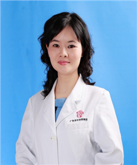

<!-- AUTO-GENERATED-BY: work/generate_obsidian_profiles.py -->

<!-- TEMPLATE: D:\workspace\信息收集整理\医生画像仓库\模板\医生画像模板.md -->

# 和秀魁

## 基础信息

| 字段 | 内容 |
|---|---|
| 姓名 | 和秀魁 |
| 医院 | 广东省妇幼保健院 |
| 科室 | 妇科（番禺院区、天河院区） |
| 职称/身份 | 主任医师 |
| 来源链接 | [官网原文](https://www.e3861.com/keshizhuanjia/zhuanjiajieshao/32514.html) |
| 采集日期 | 2026-08-14 |

## 简介/擅长

## 教育与进修经历

- 医学博士，广东省妇幼保健院主任医师，广州医科大学教授、硕士生导师、广东省妇幼保健院住院医师规范化培训妇产科专业基地教学主任。
- 广东省科技厅科技咨询专家库专家，国家级妇科内镜培训基地指导教师。
- 从事妇产科临床、科研、教学工作28年，曾在北京协和医院妇科内分泌进修。

## 科研项目与成果

- 从事妇产科临床、科研、教学工作28年，曾在北京协和医院妇科内分泌进修。
- 为妇科内分泌专科及精确医学的骨干，主持并参与多项省级课题，并在核心期刊发表多篇论文。

## 论文与学术产出

- 为妇科内分泌专科及精确医学的骨干，主持并参与多项省级课题，并在核心期刊发表多篇论文。

## 可包装亮点

- 医学博士，广东省妇幼保健院主任医师，广州医科大学教授、硕士生导师、广东省妇幼保健院住院医师规范化培训妇产科专业基地教学主任。
- 现为广东省生殖免疫与内分泌专科联盟常任理事，广东省基层医药学会生殖调控专业委员会副主委，广东省保健协会妇女保健分会委员，广东省基层医药学会生殖妇科专委会常委，中西医结合妇产与妇幼保健分会委员，中国整形美容协会女性生殖整复分会生殖保健专业学组成员，广东省免疫学会生殖免疫学专业协会委员，广东省女医师协会妇科专业委员会、中医妇科委员会委员；
- 从事妇产科临床、科研、教学工作28年，曾在北京协和医院妇科内分泌进修。
- 为妇科内分泌专科及精确医学的骨干，主持并参与多项省级课题，并在核心期刊发表多篇论文。

## 重点疾病/人群标签

- 慢性病：慢性、肿瘤、生殖、卵巢、妇科内分泌、多囊、月经、免疫、功能障碍
- 肿瘤：慢性、肿瘤、生殖、卵巢、妇科内分泌、多囊、月经、免疫、功能障碍
- 生殖疾病：慢性、肿瘤、生殖、卵巢、妇科内分泌、多囊、月经、免疫、功能障碍
- 免疫/风湿：慢性、肿瘤、生殖、卵巢、妇科内分泌、多囊、月经、免疫、功能障碍
- 术后恢复/康复：慢性、肿瘤、生殖、卵巢、妇科内分泌、多囊、月经、免疫、功能障碍
- 疑难重症：

## 证据摘录

> 只摘录官网公开信息中的短句或关键字段，不复制大段原文。

- 官网身份字段：主任医师
- 官网亮眼经历线索：医学博士，广东省妇幼保健院主任医师，广州医科大学教授、硕士生导师、广东省妇幼保健院住院医师规范化培训妇产科专业基地教学主任。 现为广东省生殖免疫与内分泌专科联盟常任理事，广东省基层医药学会生殖调控专业委员会副主委，广东省保健协会妇女保健分会委员，广东省基层医药学会生殖妇科专委会常委，中西医结合妇产与妇幼保健分会委员，中国整形美容协会女性生殖整复分会生殖保健专业学组成员，广东省免疫学会生殖免疫学专业协会委员，广东省女医师协会妇科专业委员…
- 来源链接：https://www.e3861.com/keshizhuanjia/zhuanjiajieshao/32514.html

## BD 画像摘要

和秀魁医生可作为慢性病、肿瘤、生殖疾病、免疫/风湿/感染、术后恢复/康复方向的基础画像候选。后续 BD 使用应继续以官网来源和人工复核为准，不添加疗效承诺或无来源包装。

## 合规边界

- 仅使用医院官网、官方公众号、官方小程序等公开渠道。
- 不采集私人电话、私人微信、家庭住址、患者隐私或非公开排班信息。
- 不写“保证治愈”“疗效第一”“包治疑难杂症”等无法由官网证明的表述。
