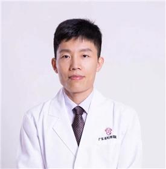

<!-- AUTO-GENERATED-BY: work/generate_obsidian_profiles.py -->

<!-- TEMPLATE: D:\workspace\信息收集整理\医生画像仓库\模板\医生画像模板.md -->

# 夏学颖

## 基础信息

| 字段 | 内容 |
|---|---|
| 姓名 | 夏学颖 |
| 医院 | 广东省妇幼保健院 |
| 科室 | 医学美容科（天河院区） |
| 职称/身份 | 主任医师 |
| 来源链接 | [官网原文](https://www.e3861.com/keshizhuanjia/zhuanjiajieshao/32883.html) |
| 采集日期 | 2026-08-14 |

## 简介/擅长

## 教育与进修经历

- 主任医师，整形外科硕士研究生，毕业于南方医科大学。

## 可包装亮点

- 主任医师，整形外科硕士研究生，毕业于南方医科大学。
- 学术任职： 中华医学会整形外科分会躯干学组委员，中国整形美容协会瘢痕医学分会委员，中国中西医结合分会医学美容专业委员会腹部年轻化与妊娠纹修复分会常委，广东省整形美容协会青年委员会副主任委员，广东省医学会整形外科学分会委员，广州市科普专家库成员。

## 重点疾病/人群标签

- 慢性病：
- 肿瘤：肿瘤
- 生殖疾病：
- 免疫/风湿：
- 术后恢复/康复：
- 疑难重症：

## 证据摘录

> 只摘录官网公开信息中的短句或关键字段，不复制大段原文。

- 官网身份字段：主任医师
- 官网亮眼经历线索：主任医师，整形外科硕士研究生，毕业于南方医科大学。 学术任职： 中华医学会整形外科分会躯干学组委员，中国整形美容协会瘢痕医学分会委员，中国中西医结合分会医学美容专业委员会腹部年轻化与妊娠纹修复分会常委，广东省整形美容协会青年委员会副主任委员，广东省医学会整形外科学分会委员，广州市科普专家库成员。
- 来源链接：https://www.e3861.com/keshizhuanjia/zhuanjiajieshao/32883.html

## BD 画像摘要

夏学颖医生可作为肿瘤方向的基础画像候选。后续 BD 使用应继续以官网来源和人工复核为准，不添加疗效承诺或无来源包装。

## 合规边界

- 仅使用医院官网、官方公众号、官方小程序等公开渠道。
- 不采集私人电话、私人微信、家庭住址、患者隐私或非公开排班信息。
- 不写“保证治愈”“疗效第一”“包治疑难杂症”等无法由官网证明的表述。
