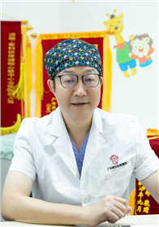

<!-- AUTO-GENERATED-BY: work/generate_obsidian_profiles.py -->

<!-- TEMPLATE: D:\workspace\信息收集整理\医生画像仓库\模板\医生画像模板.md -->

# 孙善权

## 基础信息

| 字段 | 内容 |
|---|---|
| 姓名 | 孙善权 |
| 医院 | 广东省妇幼保健院 |
| 科室 | 心脏中心（番禺院区） |
| 职称/身份 | 主任医师 |
| 来源链接 | [官网原文](https://www.e3861.com/keshizhuanjia/zhuanjiajieshao/32460.html) |
| 采集日期 | 2026-08-14 |

## 简介/擅长

## 可包装亮点

- 主任医师 心脏中心首席专家 学科带头人和创建人 广东省医学会心外科分会常委 广东省医师协会心外科分会常委 广东省医学会血管外科分会常委 深耕心血管外科领域35年,主刀各类心脏手术12000余例,系国内先天性心脏病外科领域的知名专家。
- 主要成就: 国际首创“V形补片技术修补完全性房室间隔缺损” 国际首创应用心耳重建右室流出道 国际首创气管综合成形技术 国内率先开展回旋弓解交叉手术、降主动脉移植手术 国内率先开展先心病合并食管闭锁(狭窄)和气管狭窄一期手术

## 重点疾病/人群标签

- 慢性病：
- 肿瘤：
- 生殖疾病：
- 免疫/风湿：
- 术后恢复/康复：
- 疑难重症：复杂

## 证据摘录

> 只摘录官网公开信息中的短句或关键字段，不复制大段原文。

- 官网身份字段：主任医师
- 官网亮眼经历线索：主任医师 心脏中心首席专家 学科带头人和创建人 广东省医学会心外科分会常委 广东省医师协会心外科分会常委 广东省医学会血管外科分会常委 深耕心血管外科领域35年,主刀各类心脏手术12000余例,系国内先天性心脏病外科领域的知名专家。 主要成就: 国际首创“V形补片技术修补完全性房室间隔缺损” 国际首创应用心耳重建右室流出道 国际首创气管综合成形技术 国内率先开展回旋弓解交叉手术、降主动脉移植手术 国内率先开展先心病合并食管闭锁(狭窄)…
- 来源链接：https://www.e3861.com/keshizhuanjia/zhuanjiajieshao/32460.html

## BD 画像摘要

孙善权医生可作为疑难重症方向的基础画像候选。后续 BD 使用应继续以官网来源和人工复核为准，不添加疗效承诺或无来源包装。

## 合规边界

- 仅使用医院官网、官方公众号、官方小程序等公开渠道。
- 不采集私人电话、私人微信、家庭住址、患者隐私或非公开排班信息。
- 不写“保证治愈”“疗效第一”“包治疑难杂症”等无法由官网证明的表述。
