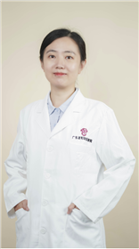

<!-- AUTO-GENERATED-BY: work/generate_obsidian_profiles.py -->

<!-- TEMPLATE: D:\workspace\信息收集整理\医生画像仓库\模板\医生画像模板.md -->

# 宗云

## 基础信息

| 字段 | 内容 |
|---|---|
| 姓名 | 宗云 |
| 医院 | 广东省妇幼保健院 |
| 科室 | 妇女保健科、妇科、更年期、40+女性健康（番禺院区、越秀院区） |
| 职称/身份 | 医师 |
| 来源链接 | [官网原文](https://www.e3861.com/keshizhuanjia/zhuanjiajieshao/33149.html) |
| 采集日期 | 2026-08-14 |

## 简介/擅长

## 教育与进修经历

- 医师， 医妇科学博士， 毕业于广州中医药大学 擅长 ： 中西医治疗月经不调、妇科内分泌与不孕症、更年期综合征、异常子宫出血、早孕安胎、妇科炎症。

## 可包装亮点

-

## 重点疾病/人群标签

- 慢性病：
- 肿瘤：
- 生殖疾病：不孕、妇科内分泌、月经
- 免疫/风湿：
- 术后恢复/康复：
- 疑难重症：

## 证据摘录

> 只摘录官网公开信息中的短句或关键字段，不复制大段原文。

- 官网身份字段：医师
- 来源链接：https://www.e3861.com/keshizhuanjia/zhuanjiajieshao/33149.html

## BD 画像摘要

宗云医生可作为生殖疾病方向的基础画像候选。后续 BD 使用应继续以官网来源和人工复核为准，不添加疗效承诺或无来源包装。

## 合规边界

- 仅使用医院官网、官方公众号、官方小程序等公开渠道。
- 不采集私人电话、私人微信、家庭住址、患者隐私或非公开排班信息。
- 不写“保证治愈”“疗效第一”“包治疑难杂症”等无法由官网证明的表述。
