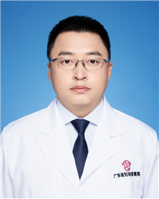

<!-- AUTO-GENERATED-BY: work/generate_obsidian_profiles.py -->

<!-- TEMPLATE: D:\workspace\信息收集整理\医生画像仓库\模板\医生画像模板.md -->

# 师小径

## 基础信息

| 字段 | 内容 |
|---|---|
| 姓名 | 师小径 |
| 医院 | 广东省妇幼保健院 |
| 科室 | 耳鼻咽喉头颈外科（番禺院区、越秀院区） |
| 职称/身份 | 副主任医师 |
| 来源链接 | [官网原文](https://www.e3861.com/keshizhuanjia/zhuanjiajieshao/32795.html) |
| 采集日期 | 2026-08-14 |

## 简介/擅长

儿童及成人过敏性鼻炎、其他鼻炎、鼻窦炎、上气道咳嗽、咽喉炎、儿童鼾症（扁桃体腺样体肥大）、中耳炎、听力障碍的诊治；儿童及成人头颈颌面部肿瘤（腮腺、颌下腺肿瘤；鳃裂瘘管，甲状舌骨囊肿）的诊治；婴幼儿耳廓畸形矫正；耳内镜显微外科手术及听力重建，人工耳蜗植入。

## 教育与进修经历

- 副主任医师，医学硕士，毕业于中南大学湘雅医学院。

## 可包装亮点

- 副主任医师，医学硕士，毕业于中南大学湘雅医学院。
- 现任广东省临床医学学会咽喉肿瘤专业委员会委员，中国中西医结合学会耳鼻咽喉科专业委员会耳内镜外科专家委员会委员。

## 重点疾病/人群标签

- 慢性病：
- 肿瘤：肿瘤
- 生殖疾病：
- 免疫/风湿：
- 术后恢复/康复：
- 疑难重症：

## 证据摘录

> 只摘录官网公开信息中的短句或关键字段，不复制大段原文。

- 官网身份字段：副主任医师
- 官网简介/擅长：儿童及成人过敏性鼻炎、其他鼻炎、鼻窦炎、上气道咳嗽、咽喉炎、儿童鼾症（扁桃体腺样体肥大）、中耳炎、听力障碍的诊治；儿童及成人头颈颌面部肿瘤（腮腺、颌下腺肿瘤；鳃裂瘘管，甲状舌骨囊肿）的诊治；婴幼儿耳廓畸形矫正；耳内镜显微外科手术及听力重建，人工耳蜗植入。
- 官网亮眼经历线索：副主任医师，医学硕士，毕业于中南大学湘雅医学院。 现任广东省临床医学学会咽喉肿瘤专业委员会委员，中国中西医结合学会耳鼻咽喉科专业委员会耳内镜外科专家委员会委员。
- 来源链接：https://www.e3861.com/keshizhuanjia/zhuanjiajieshao/32795.html

## BD 画像摘要

师小径医生可作为肿瘤方向的基础画像候选。后续 BD 使用应继续以官网来源和人工复核为准，不添加疗效承诺或无来源包装。

## 合规边界

- 仅使用医院官网、官方公众号、官方小程序等公开渠道。
- 不采集私人电话、私人微信、家庭住址、患者隐私或非公开排班信息。
- 不写“保证治愈”“疗效第一”“包治疑难杂症”等无法由官网证明的表述。
