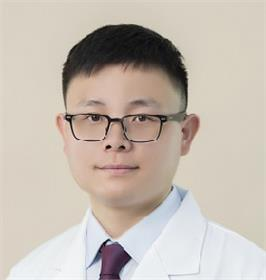

<!-- AUTO-GENERATED-BY: work/generate_obsidian_profiles.py -->

<!-- TEMPLATE: D:\workspace\信息收集整理\医生画像仓库\模板\医生画像模板.md -->

# 张恒山

## 基础信息

| 字段 | 内容 |
|---|---|
| 姓名 | 张恒山 |
| 医院 | 广东省妇幼保健院 |
| 科室 | 中西医结合儿科、儿科（番禺院区） |
| 职称/身份 | 主治医师 |
| 来源链接 | [官网原文](https://www.e3861.com/keshizhuanjia/zhuanjiajieshao/32588.html) |
| 采集日期 | 2026-08-14 |

## 简介/擅长

运用中医或中西医结合方法诊治儿童呼吸道疾病（如急慢性咳嗽、过敏性鼻炎、慢性扁桃体炎、腺样体肥大、支气管肺炎、新冠病毒感染等）；儿童消化系统疾病（如慢性腹泻、呕吐、顽固性便秘、腹痛、黄疸等）；儿童病毒感染性疾病（手足口病、疱疹病毒性龈口炎、水痘、传染性单核细胞增多症等）和儿童皮肤病（如慢性湿疹、荨麻疹等）以及儿童性早熟、发育落后、遗尿、多汗等儿童疑难杂病。

## 教育与进修经历

- 杨东新团队成员，毕业于广州中医药大学，师从李可中医药学术流派国家传承基地主任吕英教授，善用经方治疗儿科病。

## 可包装亮点

- 儿童病毒感染性疾病（手足口病、疱疹病毒性龈口炎、水痘、传染性单核细胞增多症等）和儿童皮肤病（如慢性湿疹、荨麻疹等）以及儿童性早熟、发育落后、遗尿、多汗等儿童疑难杂病。

## 重点疾病/人群标签

- 慢性病：慢性、感染、疑难
- 肿瘤：
- 生殖疾病：
- 免疫/风湿：慢性、感染、疑难
- 术后恢复/康复：
- 疑难重症：慢性、感染、疑难

## 证据摘录

> 只摘录官网公开信息中的短句或关键字段，不复制大段原文。

- 官网身份字段：主治医师
- 官网简介/擅长：运用中医或中西医结合方法诊治儿童呼吸道疾病（如急慢性咳嗽、过敏性鼻炎、慢性扁桃体炎、腺样体肥大、支气管肺炎、新冠病毒感染等）；儿童消化系统疾病（如慢性腹泻、呕吐、顽固性便秘、腹痛、黄疸等）；儿童病毒感染性疾病（手足口病、疱疹病毒性龈口炎、水痘、传染性单核细胞增多症等）和儿童皮肤病（如慢性湿疹、荨麻疹等）以及儿童性早熟、发育落后、遗尿、多汗等儿童疑难杂病。
- 官网亮眼经历线索：儿童病毒感染性疾病（手足口病、疱疹病毒性龈口炎、水痘、传染性单核细胞增多症等）和儿童皮肤病（如慢性湿疹、荨麻疹等）以及儿童性早熟、发育落后、遗尿、多汗等儿童疑难杂病。
- 来源链接：https://www.e3861.com/keshizhuanjia/zhuanjiajieshao/32588.html

## BD 画像摘要

张恒山医生可作为慢性病、免疫/风湿/感染、疑难重症方向的基础画像候选。后续 BD 使用应继续以官网来源和人工复核为准，不添加疗效承诺或无来源包装。

## 合规边界

- 仅使用医院官网、官方公众号、官方小程序等公开渠道。
- 不采集私人电话、私人微信、家庭住址、患者隐私或非公开排班信息。
- 不写“保证治愈”“疗效第一”“包治疑难杂症”等无法由官网证明的表述。
