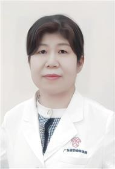

<!-- AUTO-GENERATED-BY: work/generate_obsidian_profiles.py -->

<!-- TEMPLATE: D:\workspace\信息收集整理\医生画像仓库\模板\医生画像模板.md -->

# 张晓红

## 基础信息

| 字段 | 内容 |
|---|---|
| 姓名 | 张晓红 |
| 医院 | 广东省妇幼保健院 |
| 科室 | 普通儿科、小儿血液病、小儿地中海贫血、血友病专病、小儿肿瘤内科（番禺院区、越秀院区、天河院区） |
| 职称/身份 | 副主任医师 |
| 来源链接 | [官网原文](https://www.e3861.com/keshizhuanjia/zhuanjiajieshao/32818.html) |
| 采集日期 | 2026-08-14 |

## 简介/擅长

## 教育与进修经历

- 临床研究 PI, 香港儿童医院访问学者。

## 可包装亮点

- 小儿血液科主任，副主任医师，医学博士，硕士研究生导师。
- 临床研究 PI, 香港儿童医院访问学者。
- 在儿童血液肿瘤领域从事医教研工作 20 年，熟练掌握儿童血液肿瘤疾病精准诊断和治疗，对于儿童血液肿瘤疾病早期危急重症处理有丰富的经验。
- 擅长地中海贫血、急慢性白血病，再生障碍性贫血，噬血细胞综合征，淋巴瘤，朗格罕细胞组织细胞增生症，肾母细胞瘤，神经母细胞瘤，生殖细胞瘤，肝母细胞瘤等良恶性儿童实体肿瘤的精准治疗。

## 重点疾病/人群标签

- 慢性病：慢性、肿瘤、癌、瘤、淋巴瘤、白血病、生殖、重症
- 肿瘤：慢性、肿瘤、癌、瘤、淋巴瘤、白血病、生殖、重症
- 生殖疾病：慢性、肿瘤、癌、瘤、淋巴瘤、白血病、生殖、重症
- 免疫/风湿：
- 术后恢复/康复：
- 疑难重症：慢性、肿瘤、癌、瘤、淋巴瘤、白血病、生殖、重症

## 证据摘录

> 只摘录官网公开信息中的短句或关键字段，不复制大段原文。

- 官网身份字段：副主任医师
- 官网亮眼经历线索：小儿血液科主任，副主任医师，医学博士，硕士研究生导师。 临床研究 PI, 香港儿童医院访问学者。 在儿童血液肿瘤领域从事医教研工作 20 年，熟练掌握儿童血液肿瘤疾病精准诊断和治疗，对于儿童血液肿瘤疾病早期危急重症处理有丰富的经验。 擅长地中海贫血、急慢性白血病，再生障碍性贫血，噬血细胞综合征，淋巴瘤，朗格罕细胞组织细胞增生症，肾母细胞瘤，神经母细胞瘤，生殖细胞瘤，肝母细胞瘤等良恶性儿童实体肿瘤的精准治疗。
- 来源链接：https://www.e3861.com/keshizhuanjia/zhuanjiajieshao/32818.html

## BD 画像摘要

张晓红医生可作为慢性病、肿瘤、生殖疾病、疑难重症方向的基础画像候选。后续 BD 使用应继续以官网来源和人工复核为准，不添加疗效承诺或无来源包装。

## 合规边界

- 仅使用医院官网、官方公众号、官方小程序等公开渠道。
- 不采集私人电话、私人微信、家庭住址、患者隐私或非公开排班信息。
- 不写“保证治愈”“疗效第一”“包治疑难杂症”等无法由官网证明的表述。
