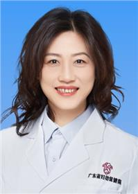

<!-- AUTO-GENERATED-BY: work/generate_obsidian_profiles.py -->

<!-- TEMPLATE: D:\workspace\信息收集整理\医生画像仓库\模板\医生画像模板.md -->

# 张曦倩

## 基础信息

| 字段 | 内容 |
|---|---|
| 姓名 | 张曦倩 |
| 医院 | 广东省妇幼保健院 |
| 科室 | 生殖健康与不孕症科、生育力保存多学科（番禺院区） |
| 职称/身份 | 主任医师 |
| 来源链接 | [官网原文](https://www.e3861.com/keshizhuanjia/zhuanjiajieshao/32504.html) |
| 采集日期 | 2026-08-14 |

## 简介/擅长

## 可包装亮点

- 医学博士，广东省妇幼保健院生殖医学中心主任，刘风华主任团队成员 广东省妇幼保健院生殖医学中心主任 广东省人类辅助生殖技术评审专家 中国女医师协会生殖医学专委会委员 广东省妇幼保健协会理事 广东省妇幼保健协会生殖保健专业委员会主任委员 广东省医学会生殖医学分会第四届委员会常务委员 广东省医院协会生殖医学发展管理专委会副主任委员 广东省医学会围产医学分会委员…

## 重点疾病/人群标签

- 慢性病：
- 肿瘤：
- 生殖疾病：生殖、不孕、卵巢、辅助生殖、胚胎、多囊、多学科
- 免疫/风湿：
- 术后恢复/康复：
- 疑难重症：生殖、不孕、卵巢、辅助生殖、胚胎、多囊、多学科

## 证据摘录

> 只摘录官网公开信息中的短句或关键字段，不复制大段原文。

- 官网身份字段：主任医师
- 官网亮眼经历线索：医学博士，广东省妇幼保健院生殖医学中心主任，刘风华主任团队成员 广东省妇幼保健院生殖医学中心主任 广东省人类辅助生殖技术评审专家 中国女医师协会生殖医学专委会委员 广东省妇幼保健协会理事 广东省妇幼保健协会生殖保健专业委员会主任委员 广东省医学会生殖医学分会第四届委员会常务委员 广东省医院协会生殖医学发展管理专委会副主任委员 广东省医学会围产医学分会委员 广东省健康管理学会生殖医学专业委员会委员 广东省医师协会生殖医学医师分会委员 广…
- 来源链接：https://www.e3861.com/keshizhuanjia/zhuanjiajieshao/32504.html

## BD 画像摘要

张曦倩医生可作为生殖疾病、疑难重症方向的基础画像候选。后续 BD 使用应继续以官网来源和人工复核为准，不添加疗效承诺或无来源包装。

## 合规边界

- 仅使用医院官网、官方公众号、官方小程序等公开渠道。
- 不采集私人电话、私人微信、家庭住址、患者隐私或非公开排班信息。
- 不写“保证治愈”“疗效第一”“包治疑难杂症”等无法由官网证明的表述。
