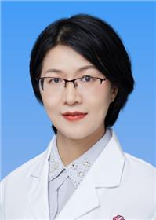

<!-- AUTO-GENERATED-BY: work/generate_obsidian_profiles.py -->

<!-- TEMPLATE: D:\workspace\信息收集整理\医生画像仓库\模板\医生画像模板.md -->

# 徐丽清

## 基础信息

| 字段 | 内容 |
|---|---|
| 姓名 | 徐丽清 |
| 医院 | 广东省妇幼保健院 |
| 科室 | 生殖健康与不孕症科（番禺院区） |
| 职称/身份 | 副主任医师 |
| 来源链接 | [官网原文](https://www.e3861.com/keshizhuanjia/zhuanjiajieshao/32844.html) |
| 采集日期 | 2026-08-14 |

## 简介/擅长

擅长不孕不育症、反复种植失败、复发性流产、多囊卵巢综合征、子宫内膜异常等疾病诊治，掌握人工授精、体外受精-胚胎移植等辅助生殖技术临床操作及妇科超声检查；曾到上海市第一妇婴保健院鲍时华主任带领的生殖免疫科进修学习复发性流产（生化妊娠）、反复种植失败、不明原因不孕症等病种的规范化诊疗。

## 教育与进修经历

- 曾到上海市第一妇婴保健院鲍时华主任带领的生殖免疫科进修学习复发性流产（生化妊娠）、反复种植失败、不明原因不孕症等病种的规范化诊疗。

## 科研项目与成果

- 主持及参与多项国家级及省市级课题，参与编著专著一本、科普读物一本，发表文章多篇；

## 论文与学术产出

- 主持及参与多项国家级及省市级课题，参与编著专著一本、科普读物一本，发表文章多篇；

## 可包装亮点

- 医学博士，刘风华主任团队成员 学术任职：广东省医师协会生殖医学医师分会青年医师专业学组委员、广东省泌尿生殖协会女性生殖医学分会委员、广东省卫生经济学会妇产科分会委员；
- 主持及参与多项国家级及省市级课题，参与编著专著一本、科普读物一本，发表文章多篇；
- 曾到上海市第一妇婴保健院鲍时华主任带领的生殖免疫科进修学习复发性流产（生化妊娠）、反复种植失败、不明原因不孕症等病种的规范化诊疗。

## 重点疾病/人群标签

- 慢性病：
- 肿瘤：
- 生殖疾病：生殖、不孕、卵巢、辅助生殖、胚胎、多囊、免疫
- 免疫/风湿：生殖、不孕、卵巢、辅助生殖、胚胎、多囊、免疫
- 术后恢复/康复：
- 疑难重症：

## 证据摘录

> 只摘录官网公开信息中的短句或关键字段，不复制大段原文。

- 官网身份字段：副主任医师
- 官网简介/擅长：擅长不孕不育症、反复种植失败、复发性流产、多囊卵巢综合征、子宫内膜异常等疾病诊治，掌握人工授精、体外受精-胚胎移植等辅助生殖技术临床操作及妇科超声检查；曾到上海市第一妇婴保健院鲍时华主任带领的生殖免疫科进修学习复发性流产（生化妊娠）、反复种植失败、不明原因不孕症等病种的规范化诊疗。
- 官网亮眼经历线索：医学博士，刘风华主任团队成员 学术任职：广东省医师协会生殖医学医师分会青年医师专业学组委员、广东省泌尿生殖协会女性生殖医学分会委员、广东省卫生经济学会妇产科分会委员； 主持及参与多项国家级及省市级课题，参与编著专著一本、科普读物一本，发表文章多篇； 曾到上海市第一妇婴保健院鲍时华主任带领的生殖免疫科进修学习复发性流产（生化妊娠）、反复种植失败、不明原因不孕症等病种的规范化诊疗。
- 来源链接：https://www.e3861.com/keshizhuanjia/zhuanjiajieshao/32844.html

## BD 画像摘要

徐丽清医生可作为生殖疾病、免疫/风湿/感染方向的基础画像候选。后续 BD 使用应继续以官网来源和人工复核为准，不添加疗效承诺或无来源包装。

## 合规边界

- 仅使用医院官网、官方公众号、官方小程序等公开渠道。
- 不采集私人电话、私人微信、家庭住址、患者隐私或非公开排班信息。
- 不写“保证治愈”“疗效第一”“包治疑难杂症”等无法由官网证明的表述。
