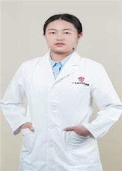

<!-- AUTO-GENERATED-BY: work/generate_obsidian_profiles.py -->

<!-- TEMPLATE: D:\workspace\信息收集整理\医生画像仓库\模板\医生画像模板.md -->

# 戢婷

## 基础信息

| 字段 | 内容 |
|---|---|
| 姓名 | 戢婷 |
| 医院 | 广东省妇幼保健院 |
| 科室 | 心理科、脑机接口睡眠中心（番禺院区、天河院区） |
| 职称/身份 | 医师 |
| 来源链接 | [官网原文](https://www.e3861.com/keshizhuanjia/zhuanjiajieshao/33210.html) |
| 采集日期 | 2026-08-14 |

## 简介/擅长

擅长抑郁障碍、焦虑障碍、双相情感障碍、睡眠障碍等常见精神心理疾病的诊疗。曾于2023.08-2023.12参加广东省临床心理治疗培训班。擅长亲子关系、人际关系等心理问题的咨询。

## 教育与进修经历

- 医学硕士，毕业于南方医科大学。
- 曾于2023.08-2023.12参加广东省临床心理治疗培训班。

## 可包装亮点

- 擅长抑郁障碍、焦虑障碍、双相情感障碍、睡眠障碍等常见精神心理疾病的诊疗。
- 曾于2023.08-2023.12参加广东省临床心理治疗培训班。
- 擅长亲子关系、人际关系等心理问题的咨询。

## 重点疾病/人群标签

- 慢性病：
- 肿瘤：
- 生殖疾病：
- 免疫/风湿：
- 术后恢复/康复：
- 疑难重症：

## 证据摘录

> 只摘录官网公开信息中的短句或关键字段，不复制大段原文。

- 官网身份字段：医师
- 官网简介/擅长：擅长抑郁障碍、焦虑障碍、双相情感障碍、睡眠障碍等常见精神心理疾病的诊疗。曾于2023.08-2023.12参加广东省临床心理治疗培训班。擅长亲子关系、人际关系等心理问题的咨询。
- 来源链接：https://www.e3861.com/keshizhuanjia/zhuanjiajieshao/33210.html

## BD 画像摘要

戢婷医生可作为广东省妇幼保健院心理科、脑机接口睡眠中心（番禺院区、天河院区）的基础医生资料入库。当前重点方向以总底表标签为准，官网未展示的信息保持空白。

## 合规边界

- 仅使用医院官网、官方公众号、官方小程序等公开渠道。
- 不采集私人电话、私人微信、家庭住址、患者隐私或非公开排班信息。
- 不写“保证治愈”“疗效第一”“包治疑难杂症”等无法由官网证明的表述。
