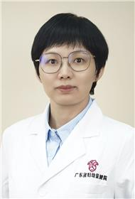

<!-- AUTO-GENERATED-BY: work/generate_obsidian_profiles.py -->

<!-- TEMPLATE: D:\workspace\信息收集整理\医生画像仓库\模板\医生画像模板.md -->

# 易爱文

## 基础信息

| 字段 | 内容 |
|---|---|
| 姓名 | 易爱文 |
| 医院 | 广东省妇幼保健院 |
| 科室 | 康复医学科（番禺院区） |
| 职称/身份 | 主任医师 |
| 来源链接 | [官网原文](https://www.e3861.com/keshizhuanjia/zhuanjiajieshao/35053.html) |
| 采集日期 | 2026-08-14 |

## 简介/擅长

## 科研项目与成果

- 主持包括省自然等省级项目7项，发表SCI及中文核心期刊论文40余篇，并参编4部专著。

## 论文与学术产出

- 主持包括省自然等省级项目7项，发表SCI及中文核心期刊论文40余篇，并参编4部专著。

## 可包装亮点

- 康复医学科副主任（主持工作），主任医师，医学博士，硕士研究生导师。
- 主持包括省自然等省级项目7项，发表SCI及中文核心期刊论文40余篇，并参编4部专著。
- 学术兼职： 澳门国际人工智能学会副会长 广东省康复医学会儿童脑病与整合康复副主任委员 广州市医院协会康复管理分会副主任委员 中国康复医学会孤独症康复专委会常务委员 广东省康复医学会学习与发展障碍康复分会常务委员 广东省妇幼保健协会发展与照护委员会常务委员 广东省针灸协会康复专委会常务委员

## 重点疾病/人群标签

- 慢性病：
- 肿瘤：
- 生殖疾病：
- 免疫/风湿：
- 术后恢复/康复：康复、恢复、高危
- 疑难重症：康复、恢复、高危

## 证据摘录

> 只摘录官网公开信息中的短句或关键字段，不复制大段原文。

- 官网身份字段：主任医师
- 官网亮眼经历线索：康复医学科副主任（主持工作），主任医师，医学博士，硕士研究生导师。 主持包括省自然等省级项目7项，发表SCI及中文核心期刊论文40余篇，并参编4部专著。 学术兼职： 澳门国际人工智能学会副会长 广东省康复医学会儿童脑病与整合康复副主任委员 广州市医院协会康复管理分会副主任委员 中国康复医学会孤独症康复专委会常务委员 广东省康复医学会学习与发展障碍康复分会常务委员 广东省妇幼保健协会发展与照护委员会常务委员 广东省针灸协会康复专委会常务…
- 来源链接：https://www.e3861.com/keshizhuanjia/zhuanjiajieshao/35053.html

## BD 画像摘要

易爱文医生可作为术后恢复/康复、疑难重症方向的基础画像候选。后续 BD 使用应继续以官网来源和人工复核为准，不添加疗效承诺或无来源包装。

## 合规边界

- 仅使用医院官网、官方公众号、官方小程序等公开渠道。
- 不采集私人电话、私人微信、家庭住址、患者隐私或非公开排班信息。
- 不写“保证治愈”“疗效第一”“包治疑难杂症”等无法由官网证明的表述。
