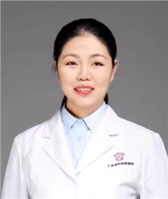

<!-- AUTO-GENERATED-BY: work/generate_obsidian_profiles.py -->

<!-- TEMPLATE: D:\workspace\信息收集整理\医生画像仓库\模板\医生画像模板.md -->

# 易菁

## 基础信息

| 字段 | 内容 |
|---|---|
| 姓名 | 易菁 |
| 医院 | 广东省妇幼保健院 |
| 科室 | 产科（番禺院区） |
| 职称/身份 | 副主任医师 |
| 来源链接 | [官网原文](https://www.e3861.com/keshizhuanjia/zhuanjiajieshao/32833.html) |
| 采集日期 | 2026-08-14 |

## 简介/擅长

宫颈机能不全诊疗、复发性流产保胎、未足月胎膜早破安胎等流产及早产综合防治。

## 可包装亮点

- 广东省妇幼保健院早产防治专科负责人 副主任医师 医学博士 社会任职 中国妇幼保健协会地中海贫血防治专业委员会委员 中国优生科学协会产科快速康复学组秘书 广东省保健协会母婴安康分会第一届常务委员 广东省基层医药学会围产专业委员会委员 广州市医学会妇产科学分会第十二届委员会常务 个人简介 中南大学湘雅医学院硕士、暨南大学医学博士。

## 重点疾病/人群标签

- 慢性病：
- 肿瘤：
- 生殖疾病：
- 免疫/风湿：
- 术后恢复/康复：康复
- 疑难重症：

## 证据摘录

> 只摘录官网公开信息中的短句或关键字段，不复制大段原文。

- 官网身份字段：副主任医师
- 官网简介/擅长：宫颈机能不全诊疗、复发性流产保胎、未足月胎膜早破安胎等流产及早产综合防治。
- 官网亮眼经历线索：广东省妇幼保健院早产防治专科负责人 副主任医师 医学博士 社会任职 中国妇幼保健协会地中海贫血防治专业委员会委员 中国优生科学协会产科快速康复学组秘书 广东省保健协会母婴安康分会第一届常务委员 广东省基层医药学会围产专业委员会委员 广州市医学会妇产科学分会第十二届委员会常务 个人简介 中南大学湘雅医学院硕士、暨南大学医学博士。
- 来源链接：https://www.e3861.com/keshizhuanjia/zhuanjiajieshao/32833.html

## BD 画像摘要

易菁医生可作为术后恢复/康复方向的基础画像候选。后续 BD 使用应继续以官网来源和人工复核为准，不添加疗效承诺或无来源包装。

## 合规边界

- 仅使用医院官网、官方公众号、官方小程序等公开渠道。
- 不采集私人电话、私人微信、家庭住址、患者隐私或非公开排班信息。
- 不写“保证治愈”“疗效第一”“包治疑难杂症”等无法由官网证明的表述。
