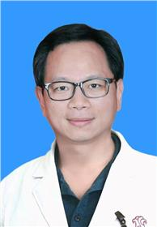

<!-- AUTO-GENERATED-BY: work/generate_obsidian_profiles.py -->

<!-- TEMPLATE: D:\workspace\信息收集整理\医生画像仓库\模板\医生画像模板.md -->

# 曾可

## 基础信息

| 字段 | 内容 |
|---|---|
| 姓名 | 曾可 |
| 医院 | 广东省妇幼保健院 |
| 科室 | 儿童内分泌遗传代谢（番禺院区、越秀院区） |
| 职称/身份 | 主任医师 |
| 来源链接 | [官网原文](https://www.e3861.com/keshizhuanjia/zhuanjiajieshao/32458.html) |
| 采集日期 | 2026-08-14 |

## 简介/擅长

## 科研项目与成果

- 主持和参与省级及国家级科研课题四项，第一作者核心期刊发表专业论文20多篇。

## 论文与学术产出

- 主持和参与省级及国家级科研课题四项，第一作者核心期刊发表专业论文20多篇。

## 可包装亮点

- 医学硕士，主任医师，亚太医学生物免疫学会基因诊断及标准化委员会委员，中国妇幼健康研究会儿童发育与疾病委员会委员，广东省精准医学应用学会儿童生长发育分会副主任委员，广东省妇幼保健协会常委，广东省医师协会内分泌科医师分会常委，广东省医学会儿科学分会儿童内分泌学组委员。
- 擅长领域： 发育异常（矮小症，身材高，性早熟，肥胖症，性发育迟缓等），甲状腺功能亢进症、甲减，呼吸系统、消化系统、其他常见儿科疾病及部分疑难慢性病的诊疗从事儿科科教研工作24年，主要领域为儿童内分泌及呼吸，消化专业。
- 主持和参与省级及国家级科研课题四项，第一作者核心期刊发表专业论文20多篇。

## 重点疾病/人群标签

- 慢性病：慢性、代谢、免疫、疑难
- 肿瘤：
- 生殖疾病：
- 免疫/风湿：慢性、代谢、免疫、疑难
- 术后恢复/康复：
- 疑难重症：慢性、代谢、免疫、疑难

## 证据摘录

> 只摘录官网公开信息中的短句或关键字段，不复制大段原文。

- 官网身份字段：主任医师
- 官网亮眼经历线索：医学硕士，主任医师，亚太医学生物免疫学会基因诊断及标准化委员会委员，中国妇幼健康研究会儿童发育与疾病委员会委员，广东省精准医学应用学会儿童生长发育分会副主任委员，广东省妇幼保健协会常委，广东省医师协会内分泌科医师分会常委，广东省医学会儿科学分会儿童内分泌学组委员。 擅长领域： 发育异常（矮小症，身材高，性早熟，肥胖症，性发育迟缓等），甲状腺功能亢进症、甲减，呼吸系统、消化系统、其他常见儿科疾病及部分疑难慢性病的诊疗从事儿科科教研工作2…
- 来源链接：https://www.e3861.com/keshizhuanjia/zhuanjiajieshao/32458.html

## BD 画像摘要

曾可医生可作为慢性病、免疫/风湿/感染、疑难重症方向的基础画像候选。后续 BD 使用应继续以官网来源和人工复核为准，不添加疗效承诺或无来源包装。

## 合规边界

- 仅使用医院官网、官方公众号、官方小程序等公开渠道。
- 不采集私人电话、私人微信、家庭住址、患者隐私或非公开排班信息。
- 不写“保证治愈”“疗效第一”“包治疑难杂症”等无法由官网证明的表述。
