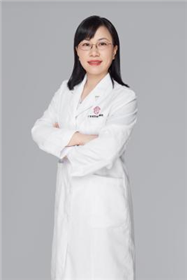

<!-- AUTO-GENERATED-BY: work/generate_obsidian_profiles.py -->

<!-- TEMPLATE: D:\workspace\信息收集整理\医生画像仓库\模板\医生画像模板.md -->

# 朱娟

## 基础信息

| 字段 | 内容 |
|---|---|
| 姓名 | 朱娟 |
| 医院 | 广东省妇幼保健院 |
| 科室 | 产前诊断（番禺院区、天河院区） |
| 职称/身份 | 副主任医师 |
| 来源链接 | [官网原文](https://www.e3861.com/keshizhuanjia/zhuanjiajieshao/32804.html) |
| 采集日期 | 2026-08-14 |

## 简介/擅长

## 教育与进修经历

- 曾在香港威尔士亲王医院妇产科培训学习，获得第五届中国出生缺陷干预救助基金会科技成果奖二等奖1项，第一发明人获得国家发明专利4项，主持参与省市级课题多项，发表了论著二十余篇。

## 科研项目与成果

- 从事妇产科临床科研多年，在优生咨询、围产期保健、遗传病的咨询及产前诊断等方面有多年的临床经验。
- 曾在香港威尔士亲王医院妇产科培训学习，获得第五届中国出生缺陷干预救助基金会科技成果奖二等奖1项，第一发明人获得国家发明专利4项，主持参与省市级课题多项，发表了论著二十余篇。

## 论文与学术产出

- 曾在香港威尔士亲王医院妇产科培训学习，获得第五届中国出生缺陷干预救助基金会科技成果奖二等奖1项，第一发明人获得国家发明专利4项，主持参与省市级课题多项，发表了论著二十余篇。

## 可包装亮点

- 朱娟，副主任医师，硕士生导师；
- 曾在香港威尔士亲王医院妇产科培训学习，获得第五届中国出生缺陷干预救助基金会科技成果奖二等奖1项，第一发明人获得国家发明专利4项，主持参与省市级课题多项，发表了论著二十余篇。
- 社会任职 广东省女医师协会出生缺陷防治专委会常委委员及秘书长 中国优生科协会母胎医学分会委员 广东省地中海贫血预防分会委员 广东省医学会健康传播自媒体联盟委员

## 重点疾病/人群标签

- 慢性病：
- 肿瘤：
- 生殖疾病：
- 免疫/风湿：感染
- 术后恢复/康复：
- 疑难重症：

## 证据摘录

> 只摘录官网公开信息中的短句或关键字段，不复制大段原文。

- 官网身份字段：副主任医师
- 官网亮眼经历线索：朱娟，副主任医师，硕士生导师； 曾在香港威尔士亲王医院妇产科培训学习，获得第五届中国出生缺陷干预救助基金会科技成果奖二等奖1项，第一发明人获得国家发明专利4项，主持参与省市级课题多项，发表了论著二十余篇。 社会任职 广东省女医师协会出生缺陷防治专委会常委委员及秘书长 中国优生科协会母胎医学分会委员 广东省地中海贫血预防分会委员 广东省医学会健康传播自媒体联盟委员
- 来源链接：https://www.e3861.com/keshizhuanjia/zhuanjiajieshao/32804.html

## BD 画像摘要

朱娟医生可作为免疫/风湿/感染方向的基础画像候选。后续 BD 使用应继续以官网来源和人工复核为准，不添加疗效承诺或无来源包装。

## 合规边界

- 仅使用医院官网、官方公众号、官方小程序等公开渠道。
- 不采集私人电话、私人微信、家庭住址、患者隐私或非公开排班信息。
- 不写“保证治愈”“疗效第一”“包治疑难杂症”等无法由官网证明的表述。
