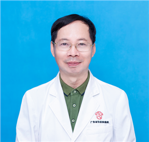

<!-- AUTO-GENERATED-BY: work/generate_obsidian_profiles.py -->

<!-- TEMPLATE: D:\workspace\信息收集整理\医生画像仓库\模板\医生画像模板.md -->

# 李增清

## 基础信息

| 字段 | 内容 |
|---|---|
| 姓名 | 李增清 |
| 医院 | 广东省妇幼保健院 |
| 科室 | 儿科呼吸（番禺院区） |
| 职称/身份 | 主任医师 |
| 来源链接 | [官网原文](https://www.e3861.com/keshizhuanjia/zhuanjiajieshao/32491.html) |
| 采集日期 | 2026-08-14 |

## 简介/擅长

## 教育与进修经历

- 儿童呼吸专科主任 专业擅长： 毕业于中山医科大学，从事儿科临床工作30余年，临床经验丰富，熟练掌握儿科常见病多发病诊治，对疑难病例诊治有独到见解，主攻专业方向为儿科呼吸系统疾病：儿童急性呼吸道感染、反复呼吸道感染、哮喘和过敏性疾病，擅长慢性咳嗽、哮喘、毛细支气管炎、胃食道返流相关的咳嗽等儿童呼吸道疾病方面的诊治。

## 可包装亮点

- 儿童呼吸专科主任 专业擅长： 毕业于中山医科大学，从事儿科临床工作30余年，临床经验丰富，熟练掌握儿科常见病多发病诊治，对疑难病例诊治有独到见解，主攻专业方向为儿科呼吸系统疾病：儿童急性呼吸道感染、反复呼吸道感染、哮喘和过敏性疾病，擅长慢性咳嗽、哮喘、毛细支气管炎、胃食道返流相关的咳嗽等儿童呼吸道疾病方面的诊治。
- 社会任职： 中国医药质量管理协会儿科呼吸标准化诊治及质量控制委员会委员、广东省医学会变态反应学分会儿童过敏与哮喘学组副组长、广东省基层医药学会儿科呼吸感染专业委员会第一届副主任委员广东省临床委员会儿科呼吸专业委员会委员

## 重点疾病/人群标签

- 慢性病：慢性、感染、疑难
- 肿瘤：
- 生殖疾病：
- 免疫/风湿：慢性、感染、疑难
- 术后恢复/康复：
- 疑难重症：慢性、感染、疑难

## 证据摘录

> 只摘录官网公开信息中的短句或关键字段，不复制大段原文。

- 官网身份字段：主任医师
- 官网亮眼经历线索：儿童呼吸专科主任 专业擅长： 毕业于中山医科大学，从事儿科临床工作30余年，临床经验丰富，熟练掌握儿科常见病多发病诊治，对疑难病例诊治有独到见解，主攻专业方向为儿科呼吸系统疾病：儿童急性呼吸道感染、反复呼吸道感染、哮喘和过敏性疾病，擅长慢性咳嗽、哮喘、毛细支气管炎、胃食道返流相关的咳嗽等儿童呼吸道疾病方面的诊治。 社会任职： 中国医药质量管理协会儿科呼吸标准化诊治及质量控制委员会委员、广东省医学会变态反应学分会儿童过敏与哮喘学组副组长…
- 来源链接：https://www.e3861.com/keshizhuanjia/zhuanjiajieshao/32491.html

## BD 画像摘要

李增清医生可作为慢性病、免疫/风湿/感染、疑难重症方向的基础画像候选。后续 BD 使用应继续以官网来源和人工复核为准，不添加疗效承诺或无来源包装。

## 合规边界

- 仅使用医院官网、官方公众号、官方小程序等公开渠道。
- 不采集私人电话、私人微信、家庭住址、患者隐私或非公开排班信息。
- 不写“保证治愈”“疗效第一”“包治疑难杂症”等无法由官网证明的表述。
