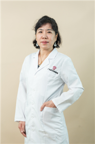

<!-- AUTO-GENERATED-BY: work/generate_obsidian_profiles.py -->

<!-- TEMPLATE: D:\workspace\信息收集整理\医生画像仓库\模板\医生画像模板.md -->

# 李文萍

## 基础信息

| 字段 | 内容 |
|---|---|
| 姓名 | 李文萍 |
| 医院 | 广东省妇幼保健院 |
| 科室 | 乳腺科（番禺院区、越秀院区） |
| 职称/身份 | 主任医师 |
| 来源链接 | [官网原文](https://www.e3861.com/keshizhuanjia/zhuanjiajieshao/32441.html) |
| 采集日期 | 2026-08-14 |

## 简介/擅长

## 可包装亮点

- 主诊组组长 医学博士 硕士生导师 荣誉： 胡润 · 平安中国好医生 第九届羊城好医生暨第七届南粤好医生。
- 社会任职： 广东医学会妇幼保健分会乳腺病学组常务委员 广州市番禺肿瘤学会专家委员 广东省女医师协会乳腺病分会专家委员 中国肿瘤防治联盟乳腺癌委员会委员 广州市抗癌协会乳腺癌专业委员会

## 重点疾病/人群标签

- 慢性病：
- 肿瘤：肿瘤、癌、乳腺癌
- 生殖疾病：
- 免疫/风湿：
- 术后恢复/康复：
- 疑难重症：

## 证据摘录

> 只摘录官网公开信息中的短句或关键字段，不复制大段原文。

- 官网身份字段：主任医师
- 官网亮眼经历线索：主诊组组长 医学博士 硕士生导师 荣誉： 胡润 · 平安中国好医生 第九届羊城好医生暨第七届南粤好医生。 社会任职： 广东医学会妇幼保健分会乳腺病学组常务委员 广州市番禺肿瘤学会专家委员 广东省女医师协会乳腺病分会专家委员 中国肿瘤防治联盟乳腺癌委员会委员 广州市抗癌协会乳腺癌专业委员会
- 来源链接：https://www.e3861.com/keshizhuanjia/zhuanjiajieshao/32441.html

## BD 画像摘要

李文萍医生可作为肿瘤方向的基础画像候选。后续 BD 使用应继续以官网来源和人工复核为准，不添加疗效承诺或无来源包装。

## 合规边界

- 仅使用医院官网、官方公众号、官方小程序等公开渠道。
- 不采集私人电话、私人微信、家庭住址、患者隐私或非公开排班信息。
- 不写“保证治愈”“疗效第一”“包治疑难杂症”等无法由官网证明的表述。
