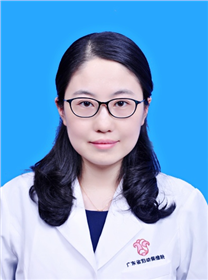

<!-- AUTO-GENERATED-BY: work/generate_obsidian_profiles.py -->

<!-- TEMPLATE: D:\workspace\信息收集整理\医生画像仓库\模板\医生画像模板.md -->

# 李海萍

## 基础信息

| 字段 | 内容 |
|---|---|
| 姓名 | 李海萍 |
| 医院 | 广东省妇幼保健院 |
| 科室 | 妇科（番禺院区、天河院区） |
| 职称/身份 | 副主任医师 |
| 来源链接 | [官网原文](https://www.e3861.com/keshizhuanjia/zhuanjiajieshao/32669.html) |
| 采集日期 | 2026-08-14 |

## 简介/擅长

## 教育与进修经历

- 社会任职： 广东省健康管理学会妇科学专业委员会委员 广东省医师协会围产医学医师分会科普与继教学组委员 广东省健康科普促进会妇幼健康分会委员 广东省基层医药学会生育调控医学专业委员会委员 《中国毕业后医学教育》杂志第二届编辑委员会青年编委 广州市健康科普专家库成员 “南粤家庭健康大讲堂”科普专家库专家

## 科研项目与成果

- 参编医学专著3部，主持及参与省级科研课题多项，发表SCI及中文核心期刊10余篇，获国家发明专利1项。

## 论文与学术产出

- 参编医学专著3部，主持及参与省级科研课题多项，发表SCI及中文核心期刊10余篇，获国家发明专利1项。

## 可包装亮点

- 副主任医师，广州医科大学硕士研究生导师。
- 参编医学专著3部，主持及参与省级科研课题多项，发表SCI及中文核心期刊10余篇，获国家发明专利1项。
- 社会任职： 广东省健康管理学会妇科学专业委员会委员 广东省医师协会围产医学医师分会科普与继教学组委员 广东省健康科普促进会妇幼健康分会委员 广东省基层医药学会生育调控医学专业委员会委员 《中国毕业后医学教育》杂志第二届编辑委员会青年编委 广州市健康科普专家库成员 “南粤家庭健康大讲堂”科普专家库专家

## 重点疾病/人群标签

- 慢性病：
- 肿瘤：
- 生殖疾病：生殖、妇科内分泌、月经、疼痛
- 免疫/风湿：
- 术后恢复/康复：生殖、妇科内分泌、月经、疼痛
- 疑难重症：

## 证据摘录

> 只摘录官网公开信息中的短句或关键字段，不复制大段原文。

- 官网身份字段：副主任医师
- 官网亮眼经历线索：副主任医师，广州医科大学硕士研究生导师。 参编医学专著3部，主持及参与省级科研课题多项，发表SCI及中文核心期刊10余篇，获国家发明专利1项。 社会任职： 广东省健康管理学会妇科学专业委员会委员 广东省医师协会围产医学医师分会科普与继教学组委员 广东省健康科普促进会妇幼健康分会委员 广东省基层医药学会生育调控医学专业委员会委员 《中国毕业后医学教育》杂志第二届编辑委员会青年编委 广州市健康科普专家库成员 “南粤家庭健康大讲堂”科普专家…
- 来源链接：https://www.e3861.com/keshizhuanjia/zhuanjiajieshao/32669.html

## BD 画像摘要

李海萍医生可作为生殖疾病、术后恢复/康复方向的基础画像候选。后续 BD 使用应继续以官网来源和人工复核为准，不添加疗效承诺或无来源包装。

## 合规边界

- 仅使用医院官网、官方公众号、官方小程序等公开渠道。
- 不采集私人电话、私人微信、家庭住址、患者隐私或非公开排班信息。
- 不写“保证治愈”“疗效第一”“包治疑难杂症”等无法由官网证明的表述。
