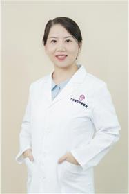

<!-- AUTO-GENERATED-BY: work/generate_obsidian_profiles.py -->

<!-- TEMPLATE: D:\workspace\信息收集整理\医生画像仓库\模板\医生画像模板.md -->

# 李真真

## 基础信息

| 字段 | 内容 |
|---|---|
| 姓名 | 李真真 |
| 医院 | 广东省妇幼保健院 |
| 科室 | 皮肤性病科、儿童过敏多学科联合（番禺院区） |
| 职称/身份 | 副主任医师 |
| 来源链接 | [官网原文](https://www.e3861.com/keshizhuanjia/zhuanjiajieshao/32617.html) |
| 采集日期 | 2026-08-14 |

## 简介/擅长

儿童、成人、孕妇湿疹，过敏性皮肤病，虫咬，癣，脱发，青春痘，祛斑去痘印、光子嫩肤，果酸换肤，腋臭，手足口，水痘，瘢痕、病毒疣、性病！

## 可包装亮点

- 现任广东省药学会皮肤病分会委员 专业擅长：儿童、成人、孕妇湿疹，过敏性皮肤病，虫咬，癣，脱发，青春痘，祛斑去痘印、光子嫩肤，果酸换肤，腋臭，手足口，水痘，瘢痕、病毒疣、性病！

## 重点疾病/人群标签

- 慢性病：
- 肿瘤：
- 生殖疾病：
- 免疫/风湿：
- 术后恢复/康复：
- 疑难重症：多学科

## 证据摘录

> 只摘录官网公开信息中的短句或关键字段，不复制大段原文。

- 官网身份字段：副主任医师
- 官网简介/擅长：儿童、成人、孕妇湿疹，过敏性皮肤病，虫咬，癣，脱发，青春痘，祛斑去痘印、光子嫩肤，果酸换肤，腋臭，手足口，水痘，瘢痕、病毒疣、性病！
- 官网亮眼经历线索：现任广东省药学会皮肤病分会委员 专业擅长：儿童、成人、孕妇湿疹，过敏性皮肤病，虫咬，癣，脱发，青春痘，祛斑去痘印、光子嫩肤，果酸换肤，腋臭，手足口，水痘，瘢痕、病毒疣、性病！
- 来源链接：https://www.e3861.com/keshizhuanjia/zhuanjiajieshao/32617.html

## BD 画像摘要

李真真医生可作为疑难重症方向的基础画像候选。后续 BD 使用应继续以官网来源和人工复核为准，不添加疗效承诺或无来源包装。

## 合规边界

- 仅使用医院官网、官方公众号、官方小程序等公开渠道。
- 不采集私人电话、私人微信、家庭住址、患者隐私或非公开排班信息。
- 不写“保证治愈”“疗效第一”“包治疑难杂症”等无法由官网证明的表述。
