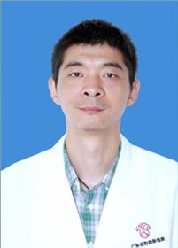

<!-- AUTO-GENERATED-BY: work/generate_obsidian_profiles.py -->

<!-- TEMPLATE: D:\workspace\信息收集整理\医生画像仓库\模板\医生画像模板.md -->

# 李鹏

## 基础信息

| 字段 | 内容 |
|---|---|
| 姓名 | 李鹏 |
| 医院 | 广东省妇幼保健院 |
| 科室 | 小儿外科（清远院区） |
| 职称/身份 | 主治医师 |
| 来源链接 | [官网原文](https://www.e3861.com/keshizhuanjia/zhuanjiajieshao/32577.html) |
| 采集日期 | 2026-08-14 |

## 简介/擅长

## 可包装亮点

- 李鹏 主治医师，广东省健康管理学会小儿外科分会常务委员，广东省医学会小儿外科分会腹腔镜学组委员，在武汉市儿童医院工作十余年、具有扎实的基础理论、娴熟的手术技巧和丰富的临床经验，擅长领域：血管瘤及血管畸形、神经母细胞瘤、肝母细胞瘤、横纹肌肉瘤、骶尾部畸胎瘤、腹膜后畸胎瘤、肠系膜囊肿、卵巢肿瘤等 专病研究：腹腔镜胆总管囊肿、巨结肠。

## 重点疾病/人群标签

- 慢性病：
- 肿瘤：肿瘤、瘤、卵巢
- 生殖疾病：肿瘤、瘤、卵巢
- 免疫/风湿：
- 术后恢复/康复：
- 疑难重症：

## 证据摘录

> 只摘录官网公开信息中的短句或关键字段，不复制大段原文。

- 官网身份字段：主治医师
- 官网亮眼经历线索：李鹏 主治医师，广东省健康管理学会小儿外科分会常务委员，广东省医学会小儿外科分会腹腔镜学组委员，在武汉市儿童医院工作十余年、具有扎实的基础理论、娴熟的手术技巧和丰富的临床经验，擅长领域：血管瘤及血管畸形、神经母细胞瘤、肝母细胞瘤、横纹肌肉瘤、骶尾部畸胎瘤、腹膜后畸胎瘤、肠系膜囊肿、卵巢肿瘤等 专病研究：腹腔镜胆总管囊肿、巨结肠。
- 来源链接：https://www.e3861.com/keshizhuanjia/zhuanjiajieshao/32577.html

## BD 画像摘要

李鹏医生可作为肿瘤、生殖疾病方向的基础画像候选。后续 BD 使用应继续以官网来源和人工复核为准，不添加疗效承诺或无来源包装。

## 合规边界

- 仅使用医院官网、官方公众号、官方小程序等公开渠道。
- 不采集私人电话、私人微信、家庭住址、患者隐私或非公开排班信息。
- 不写“保证治愈”“疗效第一”“包治疑难杂症”等无法由官网证明的表述。
