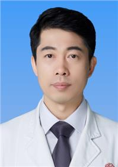

<!-- AUTO-GENERATED-BY: work/generate_obsidian_profiles.py -->

<!-- TEMPLATE: D:\workspace\信息收集整理\医生画像仓库\模板\医生画像模板.md -->

# 杜鹏

## 基础信息

| 字段 | 内容 |
|---|---|
| 姓名 | 杜鹏 |
| 医院 | 广东省妇幼保健院 |
| 科室 | 生殖健康与不孕症科（番禺院区、越秀院区、天河院区） |
| 职称/身份 | 主任医师 |
| 来源链接 | [官网原文](https://www.e3861.com/keshizhuanjia/zhuanjiajieshao/32845.html) |
| 采集日期 | 2026-08-14 |

## 简介/擅长

从事男性生殖临床工作近20年，专注于中西医结合诊治少、弱、畸精子症、男性不良生育史、免疫性不育症、精液液化异常等男性生殖疾病，尤其擅长人工授精、试管婴儿术前精子质量的中医中药调理，并在试管婴儿反复种植失败男方因素诊治及女性复发性流产男方因素诊治，拥有丰富的临床经验。

## 可包装亮点

- 中西医结合临床硕士 学术任职：中国性学会妇幼保健男科分会副主任委员、中国性学会妇幼保健男科分会男性不育学组组长、广东省辅助生殖技术评审专家库成员、广东省医学会生殖医学分会管理与伦理学组副组长、广东省医学会计划生育学分会男性生育调控学组副组长、广东省医师协会生殖医学医师分会男科医师专业组组员；
- 获得奖励：2020年荣获“第四届中国十大男性健康科普专家”称号；

## 重点疾病/人群标签

- 慢性病：
- 肿瘤：
- 生殖疾病：生殖、不孕、辅助生殖、试管、免疫
- 免疫/风湿：生殖、不孕、辅助生殖、试管、免疫
- 术后恢复/康复：
- 疑难重症：

## 证据摘录

> 只摘录官网公开信息中的短句或关键字段，不复制大段原文。

- 官网身份字段：主任医师
- 官网简介/擅长：从事男性生殖临床工作近20年，专注于中西医结合诊治少、弱、畸精子症、男性不良生育史、免疫性不育症、精液液化异常等男性生殖疾病，尤其擅长人工授精、试管婴儿术前精子质量的中医中药调理，并在试管婴儿反复种植失败男方因素诊治及女性复发性流产男方因素诊治，拥有丰富的临床经验。
- 官网亮眼经历线索：中西医结合临床硕士 学术任职：中国性学会妇幼保健男科分会副主任委员、中国性学会妇幼保健男科分会男性不育学组组长、广东省辅助生殖技术评审专家库成员、广东省医学会生殖医学分会管理与伦理学组副组长、广东省医学会计划生育学分会男性生育调控学组副组长、广东省医师协会生殖医学医师分会男科医师专业组组员； 获得奖励：2020年荣获“第四届中国十大男性健康科普专家”称号；
- 来源链接：https://www.e3861.com/keshizhuanjia/zhuanjiajieshao/32845.html

## BD 画像摘要

杜鹏医生可作为生殖疾病、免疫/风湿/感染方向的基础画像候选。后续 BD 使用应继续以官网来源和人工复核为准，不添加疗效承诺或无来源包装。

## 合规边界

- 仅使用医院官网、官方公众号、官方小程序等公开渠道。
- 不采集私人电话、私人微信、家庭住址、患者隐私或非公开排班信息。
- 不写“保证治愈”“疗效第一”“包治疑难杂症”等无法由官网证明的表述。
