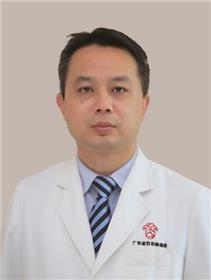

<!-- AUTO-GENERATED-BY: work/generate_obsidian_profiles.py -->

<!-- TEMPLATE: D:\workspace\信息收集整理\医生画像仓库\模板\医生画像模板.md -->

# 杨东新

## 基础信息

| 字段 | 内容 |
|---|---|
| 姓名 | 杨东新 |
| 医院 | 广东省妇幼保健院 |
| 科室 | 中西医结合儿科、中医科（番禺院区） |
| 职称/身份 | 副主任医师 |
| 来源链接 | [官网原文](https://www.e3861.com/keshizhuanjia/zhuanjiajieshao/32805.html) |
| 采集日期 | 2026-08-14 |

## 简介/擅长

## 教育与进修经历

- 先后毕业于河南中医药大学及广州中医药大学，曾赴意大利锡耶纳大学儿科开展进修学习。

## 可包装亮点

- 个人简介 ：中医儿科主任，中西医结合副主任医师。
- 先后毕业于河南中医药大学及广州中医药大学，曾赴意大利锡耶纳大学儿科开展进修学习。
- 曾获首届“广东好医生”提名奖、第六届“羊城青年好医生奖”，并于2025年获评“广州好医护·广州好医生”。
- 擅长领域 ：擅长运用中医经典理论与现代医学相结合的方法诊治儿童常见病、多发病及疑难复杂疾病。

## 重点疾病/人群标签

- 慢性病：
- 肿瘤：
- 生殖疾病：
- 免疫/风湿：风湿、免疫、感染、疑难、复杂
- 术后恢复/康复：
- 疑难重症：风湿、免疫、感染、疑难、复杂

## 证据摘录

> 只摘录官网公开信息中的短句或关键字段，不复制大段原文。

- 官网身份字段：副主任医师
- 官网亮眼经历线索：个人简介 ：中医儿科主任，中西医结合副主任医师。 先后毕业于河南中医药大学及广州中医药大学，曾赴意大利锡耶纳大学儿科开展进修学习。 曾获首届“广东好医生”提名奖、第六届“羊城青年好医生奖”，并于2025年获评“广州好医护·广州好医生”。 擅长领域 ：擅长运用中医经典理论与现代医学相结合的方法诊治儿童常见病、多发病及疑难复杂疾病。
- 来源链接：https://www.e3861.com/keshizhuanjia/zhuanjiajieshao/32805.html

## BD 画像摘要

杨东新医生可作为免疫/风湿/感染、疑难重症方向的基础画像候选。后续 BD 使用应继续以官网来源和人工复核为准，不添加疗效承诺或无来源包装。

## 合规边界

- 仅使用医院官网、官方公众号、官方小程序等公开渠道。
- 不采集私人电话、私人微信、家庭住址、患者隐私或非公开排班信息。
- 不写“保证治愈”“疗效第一”“包治疑难杂症”等无法由官网证明的表述。
