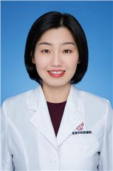

<!-- AUTO-GENERATED-BY: work/generate_obsidian_profiles.py -->

<!-- TEMPLATE: D:\workspace\信息收集整理\医生画像仓库\模板\医生画像模板.md -->

# 林小燕

## 基础信息

| 字段 | 内容 |
|---|---|
| 姓名 | 林小燕 |
| 医院 | 广东省妇幼保健院 |
| 科室 | 耳鼻咽喉头颈外科（番禺院区、越秀院区） |
| 职称/身份 | 副主任医师 |
| 来源链接 | [官网原文](https://www.e3861.com/keshizhuanjia/zhuanjiajieshao/32793.html) |
| 采集日期 | 2026-08-14 |

## 简介/擅长

## 教育与进修经历

- 副主任医师，医学硕士，毕业于中山大学，曾在北京儿童医院耳鼻咽喉头颈外科进修学习 。
- 多次受邀在广东省新生儿听力筛查诊治技术培训班做学术报告，核心期刊发表数篇论文。

## 论文与学术产出

- 多次受邀在广东省新生儿听力筛查诊治技术培训班做学术报告，核心期刊发表数篇论文。

## 可包装亮点

- 副主任医师，医学硕士，毕业于中山大学，曾在北京儿童医院耳鼻咽喉头颈外科进修学习 。
- 亚太医学生物免疫学会儿童耳鼻咽喉头颈外科分会首届委员会委员，广东省妇幼保健协会儿童听力保健专业委员会第二届委员会委员，广东省药学会第一届变态反应专家委员会委员。
- 多次受邀在广东省新生儿听力筛查诊治技术培训班做学术报告，核心期刊发表数篇论文。

## 重点疾病/人群标签

- 慢性病：慢性、免疫
- 肿瘤：
- 生殖疾病：
- 免疫/风湿：慢性、免疫
- 术后恢复/康复：
- 疑难重症：

## 证据摘录

> 只摘录官网公开信息中的短句或关键字段，不复制大段原文。

- 官网身份字段：副主任医师
- 官网亮眼经历线索：副主任医师，医学硕士，毕业于中山大学，曾在北京儿童医院耳鼻咽喉头颈外科进修学习 。 亚太医学生物免疫学会儿童耳鼻咽喉头颈外科分会首届委员会委员，广东省妇幼保健协会儿童听力保健专业委员会第二届委员会委员，广东省药学会第一届变态反应专家委员会委员。 多次受邀在广东省新生儿听力筛查诊治技术培训班做学术报告，核心期刊发表数篇论文。
- 来源链接：https://www.e3861.com/keshizhuanjia/zhuanjiajieshao/32793.html

## BD 画像摘要

林小燕医生可作为慢性病、免疫/风湿/感染方向的基础画像候选。后续 BD 使用应继续以官网来源和人工复核为准，不添加疗效承诺或无来源包装。

## 合规边界

- 仅使用医院官网、官方公众号、官方小程序等公开渠道。
- 不采集私人电话、私人微信、家庭住址、患者隐私或非公开排班信息。
- 不写“保证治愈”“疗效第一”“包治疑难杂症”等无法由官网证明的表述。
