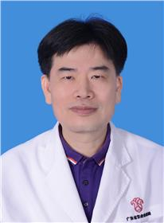

<!-- AUTO-GENERATED-BY: work/generate_obsidian_profiles.py -->

<!-- TEMPLATE: D:\workspace\信息收集整理\医生画像仓库\模板\医生画像模板.md -->

# 林炎坤

## 基础信息

| 字段 | 内容 |
|---|---|
| 姓名 | 林炎坤 |
| 医院 | 广东省妇幼保健院 |
| 科室 | 小儿泌尿外科（番禺院区、越秀院区） |
| 职称/身份 | 主任医师 |
| 来源链接 | [官网原文](https://www.e3861.com/keshizhuanjia/zhuanjiajieshao/32488.html) |
| 采集日期 | 2026-08-14 |

## 简介/擅长

## 教育与进修经历

- 2019广东“好医生好故事”仁心奖 广东揭阳人，1988年毕业中山医科大学（现中山大学医学院）从事小儿外科工作30多年，对小儿泌尿外科疾病具有丰富临床经验。

## 可包装亮点

- 小儿泌尿外科首任主任 科室首席顾问 主任医师 历任 广东省泌尿生殖学会小儿泌尿外科分会副主任委员，中国妇幼保健协会妇幼微创分会儿童泌尿学组全国常务委员，中国医师协会儿童重症分会结构畸形外科专业委员会委员 广东省医学会小儿外科分会第八九届委员会委员。
- 广东医师协会泌尿外科分会委员， 广东省儿科质量中心成员。
- 2019广东“好医生好故事”仁心奖 广东揭阳人，1988年毕业中山医科大学（现中山大学医学院）从事小儿外科工作30多年，对小儿泌尿外科疾病具有丰富临床经验。

## 重点疾病/人群标签

- 慢性病：
- 肿瘤：
- 生殖疾病：生殖、重症
- 免疫/风湿：
- 术后恢复/康复：
- 疑难重症：生殖、重症

## 证据摘录

> 只摘录官网公开信息中的短句或关键字段，不复制大段原文。

- 官网身份字段：主任医师
- 官网亮眼经历线索：小儿泌尿外科首任主任 科室首席顾问 主任医师 历任 广东省泌尿生殖学会小儿泌尿外科分会副主任委员，中国妇幼保健协会妇幼微创分会儿童泌尿学组全国常务委员，中国医师协会儿童重症分会结构畸形外科专业委员会委员 广东省医学会小儿外科分会第八九届委员会委员。 广东医师协会泌尿外科分会委员， 广东省儿科质量中心成员。 2019广东“好医生好故事”仁心奖 广东揭阳人，1988年毕业中山医科大学（现中山大学医学院）从事小儿外科工作30多年，对小儿泌尿…
- 来源链接：https://www.e3861.com/keshizhuanjia/zhuanjiajieshao/32488.html

## BD 画像摘要

林炎坤医生可作为生殖疾病、疑难重症方向的基础画像候选。后续 BD 使用应继续以官网来源和人工复核为准，不添加疗效承诺或无来源包装。

## 合规边界

- 仅使用医院官网、官方公众号、官方小程序等公开渠道。
- 不采集私人电话、私人微信、家庭住址、患者隐私或非公开排班信息。
- 不写“保证治愈”“疗效第一”“包治疑难杂症”等无法由官网证明的表述。
