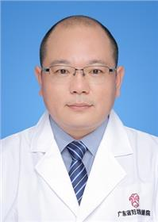

<!-- AUTO-GENERATED-BY: work/generate_obsidian_profiles.py -->

<!-- TEMPLATE: D:\workspace\信息收集整理\医生画像仓库\模板\医生画像模板.md -->

# 柴成伟

## 基础信息

| 字段 | 内容 |
|---|---|
| 姓名 | 柴成伟 |
| 医院 | 广东省妇幼保健院 |
| 科室 | 小儿普外科、小儿肿瘤外科、小儿黄疸外科、小儿便秘外科、小儿疝微创（番禺院区、越秀院区） |
| 职称/身份 | 主任医师 |
| 来源链接 | [官网原文](https://www.e3861.com/keshizhuanjia/zhuanjiajieshao/32448.html) |
| 采集日期 | 2026-08-14 |

## 简介/擅长

## 教育与进修经历

- 小儿普外科主任，主任医师，医学博士，博士研究生导师，博士后合作导师 特长： 长期从事小儿外科临床、基础研究及教学工作，有扎实的理论基础和丰富的临床经验。

## 科研项目与成果

- 成果： 主持多项省市级课题，以第一作者或通讯作者在国内外专业期刊发表论文近 20 篇，获得专利一项，知识产权保护两项。

## 论文与学术产出

- 成果： 主持多项省市级课题，以第一作者或通讯作者在国内外专业期刊发表论文近 20 篇，获得专利一项，知识产权保护两项。

## 可包装亮点

- 小儿普外科主任，主任医师，医学博士，博士研究生导师，博士后合作导师 特长： 长期从事小儿外科临床、基础研究及教学工作，有扎实的理论基础和丰富的临床经验。
- 成果： 主持多项省市级课题，以第一作者或通讯作者在国内外专业期刊发表论文近 20 篇，获得专利一项，知识产权保护两项。
- 获首届 “ 金奖杯 ” 全国小儿外科中青年医师手术技能大赛三等奖；
- 获第一、二届广东省小儿外科中青年医师手术视频大赛优胜奖。

## 重点疾病/人群标签

- 慢性病：
- 肿瘤：肿瘤、瘤
- 生殖疾病：
- 免疫/风湿：
- 术后恢复/康复：
- 疑难重症：

## 证据摘录

> 只摘录官网公开信息中的短句或关键字段，不复制大段原文。

- 官网身份字段：主任医师
- 官网亮眼经历线索：小儿普外科主任，主任医师，医学博士，博士研究生导师，博士后合作导师 特长： 长期从事小儿外科临床、基础研究及教学工作，有扎实的理论基础和丰富的临床经验。 成果： 主持多项省市级课题，以第一作者或通讯作者在国内外专业期刊发表论文近 20 篇，获得专利一项，知识产权保护两项。 获首届 “ 金奖杯 ” 全国小儿外科中青年医师手术技能大赛三等奖； 获第一、二届广东省小儿外科中青年医师手术视频大赛优胜奖。
- 来源链接：https://www.e3861.com/keshizhuanjia/zhuanjiajieshao/32448.html

## BD 画像摘要

柴成伟医生可作为肿瘤方向的基础画像候选。后续 BD 使用应继续以官网来源和人工复核为准，不添加疗效承诺或无来源包装。

## 合规边界

- 仅使用医院官网、官方公众号、官方小程序等公开渠道。
- 不采集私人电话、私人微信、家庭住址、患者隐私或非公开排班信息。
- 不写“保证治愈”“疗效第一”“包治疑难杂症”等无法由官网证明的表述。
