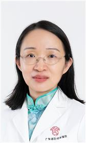

<!-- AUTO-GENERATED-BY: work/generate_obsidian_profiles.py -->

<!-- TEMPLATE: D:\workspace\信息收集整理\医生画像仓库\模板\医生画像模板.md -->

# 梁海英

## 基础信息

| 字段 | 内容 |
|---|---|
| 姓名 | 梁海英 |
| 医院 | 广东省妇幼保健院 |
| 科室 | 产科（番禺院区） |
| 职称/身份 | 主任医师 |
| 来源链接 | [官网原文](https://www.e3861.com/keshizhuanjia/zhuanjiajieshao/32483.html) |
| 采集日期 | 2026-08-14 |

## 简介/擅长

复杂性剖宫产术、宫颈环扎术、难产助产、会阴伤口缝合等技术

## 科研项目与成果

- 广东省消除母婴传播项目专家成员；
- 个人介绍: 长期从事妇产科临床、教学及科研工作，具有敏锐的分析、判断、决策能力，剖宫产手术操作精湛。

## 可包装亮点

- 广东省妇幼保健院生理产科专科主任 主任医师 社会任职： 中国优生优育协会委员；
- 广东省妇幼保健协会母婴健康管理分会常委；
- 广东省围产医学会委员；

## 重点疾病/人群标签

- 慢性病：
- 肿瘤：
- 生殖疾病：
- 免疫/风湿：
- 术后恢复/康复：伤口、复杂
- 疑难重症：伤口、复杂

## 证据摘录

> 只摘录官网公开信息中的短句或关键字段，不复制大段原文。

- 官网身份字段：主任医师
- 官网简介/擅长：复杂性剖宫产术、宫颈环扎术、难产助产、会阴伤口缝合等技术
- 官网亮眼经历线索：广东省妇幼保健院生理产科专科主任 主任医师 社会任职： 中国优生优育协会委员； 广东省妇幼保健协会母婴健康管理分会常委； 广东省围产医学会委员；
- 来源链接：https://www.e3861.com/keshizhuanjia/zhuanjiajieshao/32483.html

## BD 画像摘要

梁海英医生可作为术后恢复/康复、疑难重症方向的基础画像候选。后续 BD 使用应继续以官网来源和人工复核为准，不添加疗效承诺或无来源包装。

## 合规边界

- 仅使用医院官网、官方公众号、官方小程序等公开渠道。
- 不采集私人电话、私人微信、家庭住址、患者隐私或非公开排班信息。
- 不写“保证治愈”“疗效第一”“包治疑难杂症”等无法由官网证明的表述。
