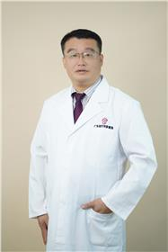

<!-- AUTO-GENERATED-BY: work/generate_obsidian_profiles.py -->

<!-- TEMPLATE: D:\workspace\信息收集整理\医生画像仓库\模板\医生画像模板.md -->

# 梅世伟

## 基础信息

| 字段 | 内容 |
|---|---|
| 姓名 | 梅世伟 |
| 医院 | 广东省妇幼保健院 |
| 科室 | 静脉曲张、血管瘤、放射科（番禺院区、越秀院区） |
| 职称/身份 | 副主任医师 |
| 来源链接 | [官网原文](https://www.e3861.com/keshizhuanjia/zhuanjiajieshao/32817.html) |
| 采集日期 | 2026-08-14 |

## 简介/擅长

## 科研项目与成果

- 发表专业论文30余篇，目前主持、参与省部课题5项。
- 长期从事血管瘤、静脉曲张疾病的基础、临床、科研研究，针对血管瘤采用局部硬化剂治疗、选择性动脉栓塞介入治疗及不同微创方式的手术治疗等较为系统、科学、有效、毒副作用小的综合治疗方法。

## 论文与学术产出

- 发表专业论文30余篇，目前主持、参与省部课题5项。

## 可包装亮点

- 副主任医师，广东省妇幼保健院介入科主任，医学硕士，暨南大学在读博士。
- 现任中国妇幼保健协会介入专业委员会委员，广东省医学会放射学会妇儿学组委员，广东省妇幼保健协会放射专委会秘书、广东省临床血管外科专委会委员、广东省基层医药学会血管外科分会常委，广州市医学会介入专委会委员等职；
- 2022年成为我院内首批8名青年科创人才培养对象之一。
- 发表专业论文30余篇，目前主持、参与省部课题5项。

## 重点疾病/人群标签

- 慢性病：
- 肿瘤：瘤
- 生殖疾病：
- 免疫/风湿：
- 术后恢复/康复：
- 疑难重症：

## 证据摘录

> 只摘录官网公开信息中的短句或关键字段，不复制大段原文。

- 官网身份字段：副主任医师
- 官网亮眼经历线索：副主任医师，广东省妇幼保健院介入科主任，医学硕士，暨南大学在读博士。 现任中国妇幼保健协会介入专业委员会委员，广东省医学会放射学会妇儿学组委员，广东省妇幼保健协会放射专委会秘书、广东省临床血管外科专委会委员、广东省基层医药学会血管外科分会常委，广州市医学会介入专委会委员等职； 2022年成为我院内首批8名青年科创人才培养对象之一。 发表专业论文30余篇，目前主持、参与省部课题5项。
- 来源链接：https://www.e3861.com/keshizhuanjia/zhuanjiajieshao/32817.html

## BD 画像摘要

梅世伟医生可作为肿瘤方向的基础画像候选。后续 BD 使用应继续以官网来源和人工复核为准，不添加疗效承诺或无来源包装。

## 合规边界

- 仅使用医院官网、官方公众号、官方小程序等公开渠道。
- 不采集私人电话、私人微信、家庭住址、患者隐私或非公开排班信息。
- 不写“保证治愈”“疗效第一”“包治疑难杂症”等无法由官网证明的表述。
