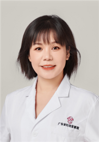

<!-- AUTO-GENERATED-BY: work/generate_obsidian_profiles.py -->

<!-- TEMPLATE: D:\workspace\信息收集整理\医生画像仓库\模板\医生画像模板.md -->

# 欧燕兰

## 基础信息

| 字段 | 内容 |
|---|---|
| 姓名 | 欧燕兰 |
| 医院 | 广东省妇幼保健院 |
| 科室 | 妇女保健科（番禺院区） |
| 职称/身份 | 副主任医师 |
| 来源链接 | [官网原文](https://www.e3861.com/keshizhuanjia/zhuanjiajieshao/32811.html) |
| 采集日期 | 2026-08-14 |

## 简介/擅长

## 科研项目与成果

- 科研成果： 主要研究宫颈癌防治及围绝经期保健，发表相关论文8篇，参与省、市级课题3项。

## 论文与学术产出

- 科研成果： 主要研究宫颈癌防治及围绝经期保健，发表相关论文8篇，参与省、市级课题3项。

## 可包装亮点

- 副主任医师，妇产科专业硕士、二级健康管理师。
- 社会任职： 现任广东省保健协会妇女保健分会常委，广东省医师协会健康专委会常委、广东省基层医药学会生殖妇科委员。
- 科研成果： 主要研究宫颈癌防治及围绝经期保健，发表相关论文8篇，参与省、市级课题3项。

## 重点疾病/人群标签

- 慢性病：
- 肿瘤：癌、生殖、月经、康复
- 生殖疾病：癌、生殖、月经、康复
- 免疫/风湿：
- 术后恢复/康复：癌、生殖、月经、康复
- 疑难重症：

## 证据摘录

> 只摘录官网公开信息中的短句或关键字段，不复制大段原文。

- 官网身份字段：副主任医师
- 官网亮眼经历线索：副主任医师，妇产科专业硕士、二级健康管理师。 社会任职： 现任广东省保健协会妇女保健分会常委，广东省医师协会健康专委会常委、广东省基层医药学会生殖妇科委员。 科研成果： 主要研究宫颈癌防治及围绝经期保健，发表相关论文8篇，参与省、市级课题3项。
- 来源链接：https://www.e3861.com/keshizhuanjia/zhuanjiajieshao/32811.html

## BD 画像摘要

欧燕兰医生可作为肿瘤、生殖疾病、术后恢复/康复方向的基础画像候选。后续 BD 使用应继续以官网来源和人工复核为准，不添加疗效承诺或无来源包装。

## 合规边界

- 仅使用医院官网、官方公众号、官方小程序等公开渠道。
- 不采集私人电话、私人微信、家庭住址、患者隐私或非公开排班信息。
- 不写“保证治愈”“疗效第一”“包治疑难杂症”等无法由官网证明的表述。
