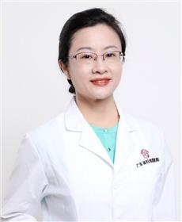

<!-- AUTO-GENERATED-BY: work/generate_obsidian_profiles.py -->

<!-- TEMPLATE: D:\workspace\信息收集整理\医生画像仓库\模板\医生画像模板.md -->

# 段冬梅

## 基础信息

| 字段 | 内容 |
|---|---|
| 姓名 | 段冬梅 |
| 医院 | 广东省妇幼保健院 |
| 科室 | 产科（清远院区） |
| 职称/身份 | 副主任医师 |
| 来源链接 | [官网原文](https://www.e3861.com/keshizhuanjia/zhuanjiajieshao/32870.html) |
| 采集日期 | 2026-08-14 |

## 简介/擅长

## 可包装亮点

- 副主任医师 社会任职： 广东省妇幼保健协会产科与促进自然分娩专业委员会 常委 广东省医师协会围产医学医师分会 委员兼秘书 广东省保健协会妇女保健分会 副主任委员 广东省医学会围产医学分会高血压学组 秘书 广东省医院协会妇产科专业委员会 委员 擅长领域： 妊娠期代谢性疾病、早产防治、围产营养；
- 对高危妊娠、妊娠合并症、危重症孕产妇救治有丰富的经验。

## 重点疾病/人群标签

- 慢性病：高血压、代谢、营养、危重、高危
- 肿瘤：
- 生殖疾病：
- 免疫/风湿：
- 术后恢复/康复：高血压、代谢、营养、危重、高危
- 疑难重症：高血压、代谢、营养、危重、高危

## 证据摘录

> 只摘录官网公开信息中的短句或关键字段，不复制大段原文。

- 官网身份字段：副主任医师
- 官网亮眼经历线索：副主任医师 社会任职： 广东省妇幼保健协会产科与促进自然分娩专业委员会 常委 广东省医师协会围产医学医师分会 委员兼秘书 广东省保健协会妇女保健分会 副主任委员 广东省医学会围产医学分会高血压学组 秘书 广东省医院协会妇产科专业委员会 委员 擅长领域： 妊娠期代谢性疾病、早产防治、围产营养； 对高危妊娠、妊娠合并症、危重症孕产妇救治有丰富的经验。
- 来源链接：https://www.e3861.com/keshizhuanjia/zhuanjiajieshao/32870.html

## BD 画像摘要

段冬梅医生可作为慢性病、术后恢复/康复、疑难重症方向的基础画像候选。后续 BD 使用应继续以官网来源和人工复核为准，不添加疗效承诺或无来源包装。

## 合规边界

- 仅使用医院官网、官方公众号、官方小程序等公开渠道。
- 不采集私人电话、私人微信、家庭住址、患者隐私或非公开排班信息。
- 不写“保证治愈”“疗效第一”“包治疑难杂症”等无法由官网证明的表述。
