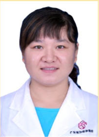

<!-- AUTO-GENERATED-BY: work/generate_obsidian_profiles.py -->

<!-- TEMPLATE: D:\workspace\信息收集整理\医生画像仓库\模板\医生画像模板.md -->

# 段红丽

## 基础信息

| 字段 | 内容 |
|---|---|
| 姓名 | 段红丽 |
| 医院 | 广东省妇幼保健院 |
| 科室 | 产科、早孕关爱（天河院区） |
| 职称/身份 | 副主任医师 |
| 来源链接 | [官网原文](https://www.e3861.com/keshizhuanjia/zhuanjiajieshao/32633.html) |
| 采集日期 | 2026-08-14 |

## 简介/擅长

高危妊娠管理、围产期保健、危重症救治。熟练掌握产科疑难剖宫产术，阴道助产术，宫颈环扎等术式。擅长产后腹直肌分离，盆底功能障碍性疾病的诊治。

## 教育与进修经历

- 副主任医师 社会任职： 广东省妇幼保健协会脐带血应用专业委员会委员 广东省性学会生殖健康专业委员会委员 简介: 硕士研究生，毕业于山西医科大学本硕连读专业，从事妇产科临床工作十余年，参与临床教学工作 8 年。

## 可包装亮点

- 副主任医师 社会任职： 广东省妇幼保健协会脐带血应用专业委员会委员 广东省性学会生殖健康专业委员会委员 简介: 硕士研究生，毕业于山西医科大学本硕连读专业，从事妇产科临床工作十余年，参与临床教学工作 8 年。
- 擅长：高危妊娠管理、围产期保健、危重症救治。
- 熟练掌握产科疑难剖宫产术，阴道助产术，宫颈环扎等术式。

## 重点疾病/人群标签

- 慢性病：
- 肿瘤：
- 生殖疾病：生殖、功能障碍、疑难、危重、高危
- 免疫/风湿：
- 术后恢复/康复：生殖、功能障碍、疑难、危重、高危
- 疑难重症：生殖、功能障碍、疑难、危重、高危

## 证据摘录

> 只摘录官网公开信息中的短句或关键字段，不复制大段原文。

- 官网身份字段：副主任医师
- 官网简介/擅长：高危妊娠管理、围产期保健、危重症救治。熟练掌握产科疑难剖宫产术，阴道助产术，宫颈环扎等术式。擅长产后腹直肌分离，盆底功能障碍性疾病的诊治。
- 官网亮眼经历线索：副主任医师 社会任职： 广东省妇幼保健协会脐带血应用专业委员会委员 广东省性学会生殖健康专业委员会委员 简介: 硕士研究生，毕业于山西医科大学本硕连读专业，从事妇产科临床工作十余年，参与临床教学工作 8 年。 擅长：高危妊娠管理、围产期保健、危重症救治。 熟练掌握产科疑难剖宫产术，阴道助产术，宫颈环扎等术式。
- 来源链接：https://www.e3861.com/keshizhuanjia/zhuanjiajieshao/32633.html

## BD 画像摘要

段红丽医生可作为生殖疾病、术后恢复/康复、疑难重症方向的基础画像候选。后续 BD 使用应继续以官网来源和人工复核为准，不添加疗效承诺或无来源包装。

## 合规边界

- 仅使用医院官网、官方公众号、官方小程序等公开渠道。
- 不采集私人电话、私人微信、家庭住址、患者隐私或非公开排班信息。
- 不写“保证治愈”“疗效第一”“包治疑难杂症”等无法由官网证明的表述。
