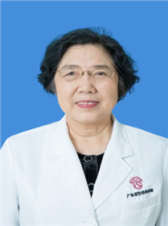

<!-- AUTO-GENERATED-BY: work/generate_obsidian_profiles.py -->

<!-- TEMPLATE: D:\workspace\信息收集整理\医生画像仓库\模板\医生画像模板.md -->

# 毛玲芝

## 基础信息

| 字段 | 内容 |
|---|---|
| 姓名 | 毛玲芝 |
| 医院 | 广东省妇幼保健院 |
| 科室 | 妇科（番禺院区） |
| 职称/身份 | 主任医师 |
| 来源链接 | [官网原文](https://www.e3861.com/keshizhuanjia/zhuanjiajieshao/32512.html) |
| 采集日期 | 2026-08-14 |

## 简介/擅长

各种妇科疑难杂症，宫颈及妇科肿瘤，月经不调及不孕症、盆底等疾病的诊治。

## 教育与进修经历

- 毕业于湖南医学院医疗系（现中南大学湘雅医学院），2006年在澳大利亚及香港学习内窥镜及宫颈疾病。

## 可包装亮点

- 妇产科主任医师 教育背景：1982年12月。
- 参与《子宫颈癌筛查及早诊早治的网络管理》获广东省科学技术进步三等奖。
- 临床擅长：各种妇科疑难杂症，宫颈及妇科肿瘤，月经不调及不孕症、盆底等疾病的诊治。

## 重点疾病/人群标签

- 慢性病：
- 肿瘤：肿瘤、癌、不孕、月经、疑难
- 生殖疾病：肿瘤、癌、不孕、月经、疑难
- 免疫/风湿：
- 术后恢复/康复：
- 疑难重症：肿瘤、癌、不孕、月经、疑难

## 证据摘录

> 只摘录官网公开信息中的短句或关键字段，不复制大段原文。

- 官网身份字段：主任医师
- 官网简介/擅长：各种妇科疑难杂症，宫颈及妇科肿瘤，月经不调及不孕症、盆底等疾病的诊治。
- 官网亮眼经历线索：妇产科主任医师 教育背景：1982年12月。 参与《子宫颈癌筛查及早诊早治的网络管理》获广东省科学技术进步三等奖。 临床擅长：各种妇科疑难杂症，宫颈及妇科肿瘤，月经不调及不孕症、盆底等疾病的诊治。
- 来源链接：https://www.e3861.com/keshizhuanjia/zhuanjiajieshao/32512.html

## BD 画像摘要

毛玲芝医生可作为肿瘤、生殖疾病、疑难重症方向的基础画像候选。后续 BD 使用应继续以官网来源和人工复核为准，不添加疗效承诺或无来源包装。

## 合规边界

- 仅使用医院官网、官方公众号、官方小程序等公开渠道。
- 不采集私人电话、私人微信、家庭住址、患者隐私或非公开排班信息。
- 不写“保证治愈”“疗效第一”“包治疑难杂症”等无法由官网证明的表述。
