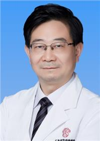

<!-- AUTO-GENERATED-BY: work/generate_obsidian_profiles.py -->

<!-- TEMPLATE: D:\workspace\信息收集整理\医生画像仓库\模板\医生画像模板.md -->

# 汪李虎

## 基础信息

| 字段 | 内容 |
|---|---|
| 姓名 | 汪李虎 |
| 医院 | 广东省妇幼保健院 |
| 科室 | 生殖健康与不孕症科（番禺院区） |
| 职称/身份 | 主任医师 |
| 来源链接 | [官网原文](https://www.e3861.com/keshizhuanjia/zhuanjiajieshao/32501.html) |
| 采集日期 | 2026-08-14 |

## 简介/擅长

对男性不育症、性功能障碍、前列腺炎尤其少弱畸精子症的诊疗有丰富临床经验。擅长睾丸显微取精术及采用经皮睾丸精子抽吸术治疗无精子症和不射精症。

## 论文与学术产出

- 研究方向：男性生殖内分泌疾病及男性不育，发表论文20余篇，著作5部；

## 可包装亮点

- 医学硕士 学术任职：国家辅助生殖技术评审专家、中国性学会第六届理事会常务理事、中国性学会妇幼保健男科分会主任委员等；
- 研究方向：男性生殖内分泌疾病及男性不育，发表论文20余篇，著作5部；

## 重点疾病/人群标签

- 慢性病：
- 肿瘤：
- 生殖疾病：生殖、不孕、辅助生殖、功能障碍
- 免疫/风湿：
- 术后恢复/康复：生殖、不孕、辅助生殖、功能障碍
- 疑难重症：

## 证据摘录

> 只摘录官网公开信息中的短句或关键字段，不复制大段原文。

- 官网身份字段：主任医师
- 官网简介/擅长：对男性不育症、性功能障碍、前列腺炎尤其少弱畸精子症的诊疗有丰富临床经验。擅长睾丸显微取精术及采用经皮睾丸精子抽吸术治疗无精子症和不射精症。
- 官网亮眼经历线索：医学硕士 学术任职：国家辅助生殖技术评审专家、中国性学会第六届理事会常务理事、中国性学会妇幼保健男科分会主任委员等； 研究方向：男性生殖内分泌疾病及男性不育，发表论文20余篇，著作5部；
- 来源链接：https://www.e3861.com/keshizhuanjia/zhuanjiajieshao/32501.html

## BD 画像摘要

汪李虎医生可作为生殖疾病、术后恢复/康复方向的基础画像候选。后续 BD 使用应继续以官网来源和人工复核为准，不添加疗效承诺或无来源包装。

## 合规边界

- 仅使用医院官网、官方公众号、官方小程序等公开渠道。
- 不采集私人电话、私人微信、家庭住址、患者隐私或非公开排班信息。
- 不写“保证治愈”“疗效第一”“包治疑难杂症”等无法由官网证明的表述。
