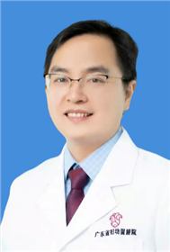

<!-- AUTO-GENERATED-BY: work/generate_obsidian_profiles.py -->

<!-- TEMPLATE: D:\workspace\信息收集整理\医生画像仓库\模板\医生画像模板.md -->

# 洪小山

## 基础信息

| 字段 | 内容 |
|---|---|
| 姓名 | 洪小山 |
| 医院 | 广东省妇幼保健院 |
| 科室 | 妇科（番禺院区） |
| 职称/身份 | 副主任医师 |
| 来源链接 | [官网原文](https://www.e3861.com/keshizhuanjia/zhuanjiajieshao/32851.html) |
| 采集日期 | 2026-08-14 |

## 简介/擅长

单孔腹腔镜手术（微无创），妇科良恶性肿瘤（子宫肌瘤、卵巢囊肿、卵巢癌、宫颈癌、子宫内膜癌等）宫颈疾病、不孕症、子宫内膜异位症等的综合诊治。在妇科领域发表论核心论文15篇，SCI论文13篇，参与省级课题2项。

## 教育与进修经历

- 副主任医师， 在职博士，硕士研究生导师 2012年毕业于广州医科大学妇产科专业，毕业后工作于广东省妇幼保健院妇科至今。

## 科研项目与成果

- 在妇科领域发表论核心论文15篇，SCI论文13篇，参与省级课题2项。

## 论文与学术产出

- 在妇科领域发表论核心论文15篇，SCI论文13篇，参与省级课题2项。

## 可包装亮点

- 副主任医师， 在职博士，硕士研究生导师 2012年毕业于广州医科大学妇产科专业，毕业后工作于广东省妇幼保健院妇科至今。
- 在妇科领域发表论核心论文15篇，SCI论文13篇，参与省级课题2项。
- 社会任职: 广东省医学会妇产科分会委员，广东省妇幼保健协会妇科专业委员委员 ，广东省临床医学学会妇产科青年专委会常委，广东省妇幼保健学会妇科肿瘤专业委员会委员，广东省抗癌协会卵巢癌专委会委员，广东省中医药学会整合生殖学会常委，广东省卫生经济学会妇产科分会委员，广东省自然医学研究会女性身心健康管理专业委员会常委

## 重点疾病/人群标签

- 慢性病：
- 肿瘤：肿瘤、癌、瘤、生殖、不孕、卵巢
- 生殖疾病：肿瘤、癌、瘤、生殖、不孕、卵巢
- 免疫/风湿：
- 术后恢复/康复：
- 疑难重症：

## 证据摘录

> 只摘录官网公开信息中的短句或关键字段，不复制大段原文。

- 官网身份字段：副主任医师
- 官网简介/擅长：单孔腹腔镜手术（微无创），妇科良恶性肿瘤（子宫肌瘤、卵巢囊肿、卵巢癌、宫颈癌、子宫内膜癌等）宫颈疾病、不孕症、子宫内膜异位症等的综合诊治。在妇科领域发表论核心论文15篇，SCI论文13篇，参与省级课题2项。
- 官网亮眼经历线索：副主任医师， 在职博士，硕士研究生导师 2012年毕业于广州医科大学妇产科专业，毕业后工作于广东省妇幼保健院妇科至今。 在妇科领域发表论核心论文15篇，SCI论文13篇，参与省级课题2项。 社会任职: 广东省医学会妇产科分会委员，广东省妇幼保健协会妇科专业委员委员 ，广东省临床医学学会妇产科青年专委会常委，广东省妇幼保健学会妇科肿瘤专业委员会委员，广东省抗癌协会卵巢癌专委会委员，广东省中医药学会整合生殖学会常委，广东省卫生经济学会妇产…
- 来源链接：https://www.e3861.com/keshizhuanjia/zhuanjiajieshao/32851.html

## BD 画像摘要

洪小山医生可作为肿瘤、生殖疾病方向的基础画像候选。后续 BD 使用应继续以官网来源和人工复核为准，不添加疗效承诺或无来源包装。

## 合规边界

- 仅使用医院官网、官方公众号、官方小程序等公开渠道。
- 不采集私人电话、私人微信、家庭住址、患者隐私或非公开排班信息。
- 不写“保证治愈”“疗效第一”“包治疑难杂症”等无法由官网证明的表述。
