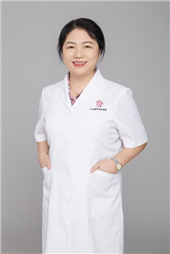

<!-- AUTO-GENERATED-BY: work/generate_obsidian_profiles.py -->

<!-- TEMPLATE: D:\workspace\信息收集整理\医生画像仓库\模板\医生画像模板.md -->

# 潘小英

## 基础信息

| 字段 | 内容 |
|---|---|
| 姓名 | 潘小英 |
| 医院 | 广东省妇幼保健院 |
| 科室 | 产前诊断（番禺院区） |
| 职称/身份 | 主任医师 |
| 来源链接 | [官网原文](https://www.e3861.com/keshizhuanjia/zhuanjiajieshao/32526.html) |
| 采集日期 | 2026-08-14 |

## 简介/擅长

## 教育与进修经历

- 医学硕士， 曾在美国南卡大学和哈佛大学进修产前诊断和遗传学实验。

## 科研项目与成果

- 特长： 一直致力于胎儿医学、遗传病产前诊断等临床、科研数十年。
- 成果： 参与编写《产前遗传咨询》和《临床遗传咨询》，发表论文多篇；
- 省卫生厅科研立项、参加国家十一五科技攻关课题。

## 论文与学术产出

- 成果： 参与编写《产前遗传咨询》和《临床遗传咨询》，发表论文多篇；

## 可包装亮点

- 医学硕士， 曾在美国南卡大学和哈佛大学进修产前诊断和遗传学实验。
- 成果： 参与编写《产前遗传咨询》和《临床遗传咨询》，发表论文多篇；
- 社会任职： 前卫生部全国产前诊断专家组成员 前中华遗传学会广东省分会常委

## 重点疾病/人群标签

- 慢性病：
- 肿瘤：
- 生殖疾病：
- 免疫/风湿：
- 术后恢复/康复：
- 疑难重症：罕见

## 证据摘录

> 只摘录官网公开信息中的短句或关键字段，不复制大段原文。

- 官网身份字段：主任医师
- 官网亮眼经历线索：医学硕士， 曾在美国南卡大学和哈佛大学进修产前诊断和遗传学实验。 成果： 参与编写《产前遗传咨询》和《临床遗传咨询》，发表论文多篇； 社会任职： 前卫生部全国产前诊断专家组成员 前中华遗传学会广东省分会常委
- 来源链接：https://www.e3861.com/keshizhuanjia/zhuanjiajieshao/32526.html

## BD 画像摘要

潘小英医生可作为疑难重症方向的基础画像候选。后续 BD 使用应继续以官网来源和人工复核为准，不添加疗效承诺或无来源包装。

## 合规边界

- 仅使用医院官网、官方公众号、官方小程序等公开渠道。
- 不采集私人电话、私人微信、家庭住址、患者隐私或非公开排班信息。
- 不写“保证治愈”“疗效第一”“包治疑难杂症”等无法由官网证明的表述。
