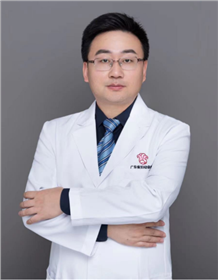

<!-- AUTO-GENERATED-BY: work/generate_obsidian_profiles.py -->

<!-- TEMPLATE: D:\workspace\信息收集整理\医生画像仓库\模板\医生画像模板.md -->

# 王三锋

## 基础信息

| 字段 | 内容 |
|---|---|
| 姓名 | 王三锋 |
| 医院 | 广东省妇幼保健院 |
| 科室 | 妇科（越秀院区） |
| 职称/身份 | 主任医师 |
| 来源链接 | [官网原文](https://www.e3861.com/keshizhuanjia/zhuanjiajieshao/32548.html) |
| 采集日期 | 2026-08-14 |

## 简介/擅长

妇科肿瘤、CIN2、CIN3 .

## 可包装亮点

- 专长：妇科肿瘤、CIN2、CIN3 . 简介：妇科主任医师，广东省基层医药学会妇科分会副主任委员，广东省中药学会妇科肿瘤专委会常委，广东省基层医药学会妇科肿瘤专委会常委，广东省预防医学会宫颈癌防治专委会常委，中国研究型医院学会妇科肿瘤专委会青年委员，广东省健康管理学会生育力保护专委会常委。
- 从事妇产科临床工作20余年擅长妇科良恶性肿瘤的微创诊治、宫颈疾病的个体化诊治、子宫内膜异位症治疗，获评岭南名医、广州市中青年实力医生等。

## 重点疾病/人群标签

- 慢性病：
- 肿瘤：肿瘤、癌
- 生殖疾病：
- 免疫/风湿：
- 术后恢复/康复：
- 疑难重症：

## 证据摘录

> 只摘录官网公开信息中的短句或关键字段，不复制大段原文。

- 官网身份字段：主任医师
- 官网简介/擅长：妇科肿瘤、CIN2、CIN3 .
- 官网亮眼经历线索：专长：妇科肿瘤、CIN2、CIN3 . 简介：妇科主任医师，广东省基层医药学会妇科分会副主任委员，广东省中药学会妇科肿瘤专委会常委，广东省基层医药学会妇科肿瘤专委会常委，广东省预防医学会宫颈癌防治专委会常委，中国研究型医院学会妇科肿瘤专委会青年委员，广东省健康管理学会生育力保护专委会常委。 从事妇产科临床工作20余年擅长妇科良恶性肿瘤的微创诊治、宫颈疾病的个体化诊治、子宫内膜异位症治疗，获评岭南名医、广州市中青年实力医生等。
- 来源链接：https://www.e3861.com/keshizhuanjia/zhuanjiajieshao/32548.html

## BD 画像摘要

王三锋医生可作为肿瘤方向的基础画像候选。后续 BD 使用应继续以官网来源和人工复核为准，不添加疗效承诺或无来源包装。

## 合规边界

- 仅使用医院官网、官方公众号、官方小程序等公开渠道。
- 不采集私人电话、私人微信、家庭住址、患者隐私或非公开排班信息。
- 不写“保证治愈”“疗效第一”“包治疑难杂症”等无法由官网证明的表述。
